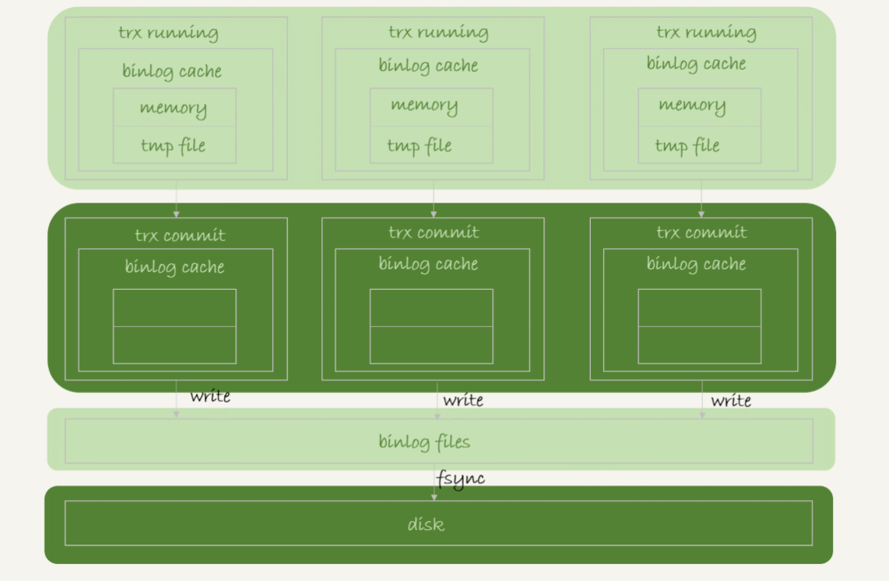

# mysql数据储存

## 一. binlog 的写入机制

`binlog` 的写入逻辑比较简单：事务执行过程中，先把日志写到 `binlog cache`，事务提交的时候，再把 `binlog cache` 写到 `binlog` 文件中

系统给 `binlog cache` 分配了一片内存，每个线程一个，参数 `binlog_cache_size` 用于控制单个线程内 `binlog cache` 所占内存的大小。如果超过了这个参数规定的大小，就要暂存到磁盘。

> 每个线程有自己 `binlog cache`，但是共用同一份 binlog 文件。
>
> - 图中的 `write`，指的就是指把日志写入到文件系统的 page cache，并没有把数据持久化到磁盘，所以速度比较快。
> - 图中的 `fsync`，才是将数据持久化到磁盘的操作。一般情况下，我们认为 `fsync` 才占磁盘的 IOPS。
>
> `write` 和 `fsync` 的时机，是由参数 sync_binlog 控制的：
>
> - `sync_binlog=0` 的时候，表示每次提交事务都只 `write`，不 `fsync`；
> - `sync_binlog=1` 的时候，表示每次提交事务都会执行 `fsync`；
> - `sync_binlog=N(N>1)` 的时候，表示每次提交事务都 `write`，但累积 N 个事务后才 `fsync`。
>
> NOTE: 将 `sync_binlog` 设置为 N，对应的风险是：如果主机发生异常重启，会丢失最近 N 个事务的 `binlog` 日志。

## 二. redo log 的写入机制

为了控制 `redo log` 的写入策略，InnoDB 提供了` innodb_flush_log_at_trx_commit `参数，它有三种可能取值：

- 设置为 0 的时候，表示每次事务提交时都只是把 `redo log` 留在 `redo log buffer `中 ;
- 设置为 1 的时候，表示每次事务提交时都将 `redo log` 直接持久化到磁盘；
- 设置为 2 的时候，表示每次事务提交时都只是把 `redo log` 写到 page cache。

InnoDB 有一个后台线程，每隔 1 秒，就会把 `redo log buffer` 中的日志，调用 write 写到文件系统的`page cache`，然后调用 `fsync` 持久化到磁盘。

除了后台线程每秒一次的轮询操作外，还有两种场景会让一个没有提交的事务的 `redo log` 写入到磁盘中.

- `redo log buffer` 占用的空间即将达到 `innodb_log_buffer_size` 一半的时候，后台线程会主动写盘
- 并行的事务提交的时候，顺带将这个事务的 `redo log buffer` 持久化到磁盘

