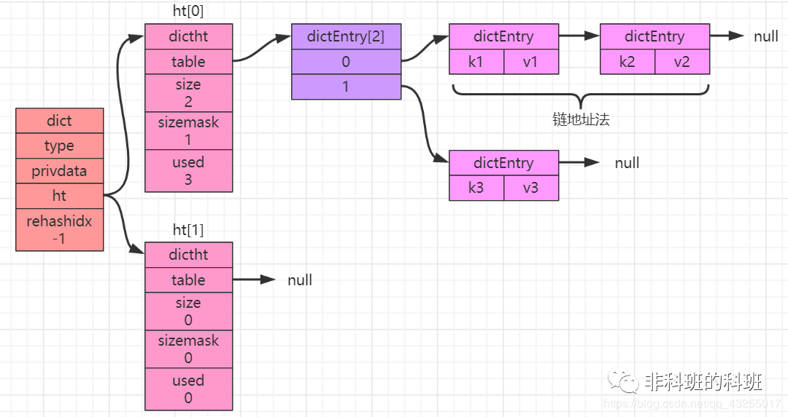
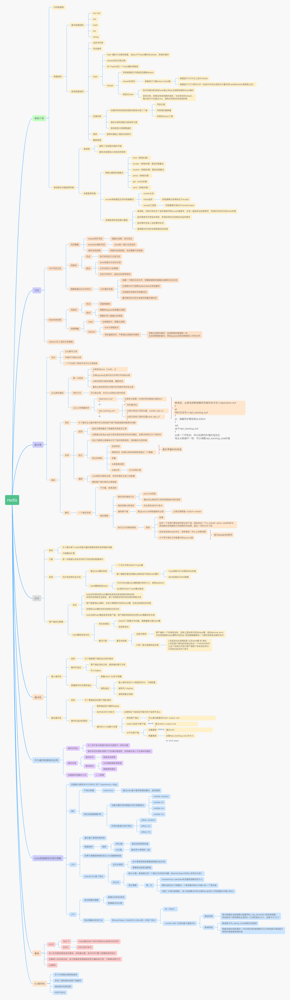

[TOC]

# redis数据结构

## 一. redis基础类型 

| 数据类型     | 底层数据结构      |
| ------------ | ----------------- |
| `String`     | 简单动态字符串    |
| `List`       | 双向链表,压缩列表 |
| `Hash`       | 哈希表,压缩列表   |
| `Sorted Set` | 跳表,压缩列表     |
| `Set`        | 整数数组,哈希表   |

## 二. 数据结构的时间复杂度

| 名称     | 时间复杂度 |
| -------- | ---------- |
| 哈希表   | O(1)       |
| 跳表     | O(logN)    |
| 双向链表 | O(N)       |
| 压缩列表 | O(N)       |
| 整数数组 | O(N)       |

## 三. redis 线程模型

1.redis真的只有单线程吗？ 

​	单线程是指网络io和数据读写操作是由一个线程完成的。数据清理，持久化，主从复制也使用到了其他线程。 

2.为什么使用单线程？

​	避免多线程开发的并发控制问题，且多线程开发代码复杂，可维护性差。 

3.单线程为什么这么快？ 

​	内存+高效的数据结构+io多路复用

## 四. redis全局哈希表

### a. Dict Entry

### b. Redis Object

**RedisObject**内部组成包括了**元数据**和**数据指针**。

- **元数据**包括 `type`、`encoding`、`lru` 和 `refcount` 4 个

  - **type**：表示值的类型，涵盖了五大基本类型；
  - **encoding**：是值的编码方式，用来表示 Redis 中实现各个基本类型的底层数据结构，例如 SDS、压缩列表、哈希表、跳表等；
  - **lru**：记录了这个对象最后一次被访问的时间，用于淘汰过期的键值对；
  - **refcount**：记录了对象的引用计数；
- **数据指针**: 具体类型和编码,实现具体的实数

#### 1. String类型 

- `Long类型整数数据`: **RedisObject** 中的指针就直接赋值为整数数据了，这样就不用额外的指针再指向整数了，节省了指针的空间开销. 这种布局方式称为`int编码模式`.
- `String类型字符串数据`:  字符串型式就会用简单动态字符串（Simple Dynamic String，SDS）结构体来保存.
  - **字符串小于等于44字节**时，**RedisObject** 中的元数据、指针和 SDS 是一块连续的内存区域，这样就可以避免内存碎片。这种布局方式也被称为 `embstr编码模式`。
  - **字符串大于 44 字节**时，SDS 的数据量就开始变多了，Redis 就不再把 **SDS** 和 **RedisObject** 布局在一起了，而是会给 SDS 分配独立的空间，并用指针指向 SDS 结构。这种布局方式被称为 `raw编码模式`。

  - RedisObject数据的编码方式

- **`len`**：占 4 个字节，表示 buf 的已用长度。
- **`alloc`**：也占个 4 字节，表示 buf 的实际分配长度，一般大于 len
- **`buf`**：字节数组，保存实际数据。为了表示字节数组的结束，Redis 会自动在数组最后加一个“\0”，这就会额外占用 1 个字节的开销。

#### 2. Hash类型 

Hash对象的实现方式有两种分别是[ziplist](#d. ziplist数据结构)、[hashtable](#c. hashtable数据结构 )

> hash使用哈希集合或压缩列表的阀值:
>
> - **hash-max-ziplist-entries**：表示用压缩列表保存时哈希集合中的最大元素个数
> - **hash-max-ziplist-value**：表示用压缩列表保存时哈希集合中单个元素的最大长度
>
> 如果我们往 Hash 集合中写入的元素个数超过了 **hash-max-ziplist-entries**，或者写入的单个元素大小超过了 **hash-max-ziplist-value**，Redis 就会自动把 Hash 类型的实现结构由压缩列表转为哈希表

#### 3. List类型

List的底层实现使用[ziplist](#d. ziplist数据结构)、和`linkedlist`

#### 4. Set类型 

Set的底层实现是[hashtable](#c. hashtable数据结构 )和[intset]()

#### 4. ZSet类型 

ZSet的底层实现是[ziplist](#d. ziplist数据结构)和`skiplist`

### c. hashtable数据结构

> hash表最大的问题就是hash冲突，为了解决hash冲突，假如hashtable中不同的key通过计算得到同一个index，就会形成单向链表（**「链地址法」**）
>
> 哈希冲突链上的元素只能通过指针逐一查找再操作。如果哈希表里写入的数据越来越多，哈希冲突可能也会越来越多，这就会导致某些哈希冲突链过长，进而导致这个链上的元素查找耗时长，效率降低.Redis 会对哈希表做 rehash 操作
>
> Redis 采用了渐进式 rehash

### d. ziplist数据结构

- `zlbytes`: 4个字节的大小，记录压缩列表占用内存的字节数
- `zltail`: 4个字节大小，记录表尾节点距离起始地址的偏移量，用于快速定位到尾节点的地址。
-  `zllen`: 2个字节的大小，记录压缩列表中的entry节点数
- `entry`: 表示列表中的每一个节点
  - **`prev_len`**，表示前一个 entry 的长度。prev_len 有两种取值情况：1字节或 5字节。取值 1 字节时，表示上一个 entry 的长度小于 254 字节。虽然 1 字节的值能表示的数值范围是 0 到 255，但是压缩列表中 zlend 的取值默认是 255，因此，就默认用 255 表示整个压缩列表的结束，其他表示长度的地方就不能再用 255 这个值了。所以，当上一个 entry 长度小于 254 字节时，prev_len 取值为 1 字节，否则，就取值为 5 字节。
  - **`encoding`**：表示编码方式, 1字节；
  - **`len`**：表示自身长度,  4 字节；
  - **`content`**：保存实际数据。
- `zlend`: 表示列表结束

## Redis容量预估

[Redis容量预估](http://www.redis.cn/redis_memory/)

## Redis思维导图

