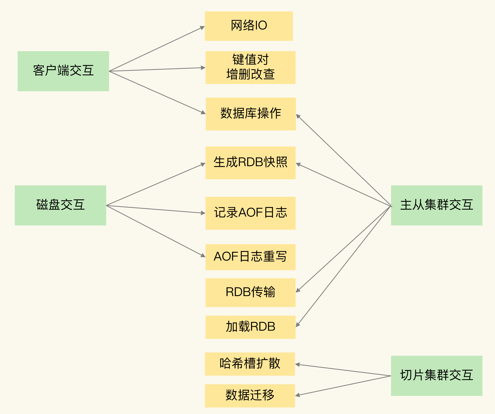

[TOC]

## 一.  Redis 内部的阻塞式操作

Redis 实例在运行时，要和许多对象进行交互，这些不同的交互就会涉及不同的操作，下面我们来看看和 Redis 实例交互的对象，以及交互时会发生的操作。

- **客户端**：网络 IO，键值对增删改查操作，数据库操作；
- **磁盘**：生成 RDB 快照，记录 AOF 日志，AOF 日志重写；
- **主从节点**：主库生成、传输 RDB 文件，从库接收 RDB 文件、清空数据库、加载 RDB 文件；
- **切片集群实例**：向其他实例传输哈希槽信息，数据迁移

### 1. 和客户端交互时的阻塞点

- 集合全量查询和聚合操作
- bigkey 删除操作
- 清空数据库

### 2. 和磁盘交互时的阻塞点

- AOF 日志同步写。

### 3. 主从节点交互时的阻塞点

- 加载 RDB 文件

### 4. 切片集群实例交互时的阻塞点

- 如果你使用了 Redis Cluster 方案，而且同时正好迁移的是 bigkey 的话，就会造成主线程的阻塞，因为 Redis Cluster 使用了同步迁移。

哪些阻塞点可以异步执行？

> 如果一个操作能被异步执行，就意味着，它并不是 Redis 主线程的关键路径上的操作
>
> - 读操作是典型的关键路径操作.
> - 删除操作是非关键路径操作.
>
> 我们可以使用 Redis 的异步子线程机制来实现 bigkey 删除，清空数据库，以及 AOF 日志同步写
>
> Redis 主线程启动后，会使用操作系统提供的 pthread_create 函数创建 3 个子线程，分别由它们负责 AOF 日志写操作、键值对删除以及文件关闭的异步执行。
>
> 异步的键值对删除和数据库清空操作是 Redis 4.0 后提供的功能，Redis 也提供了新的命令来执行这两个操作。
>
> - 键值对删除：当你的集合类型中有大量元素（例如有百万级别或千万级别元素）需要删除时，我建议你使用 UNLINK 命令。
> - 清空数据库：可以在 FLUSHDB 和 FLUSHALL 命令后加上 ASYNC 选项，这样就可以让后台子线程异步地清空数据库，如下所示：

## 二. CPU 核和 NUMA 架构的影响

Redis 主线程的运行时信息需要被重新加载到另一个 CPU 核上，而且，此时，另一个 CPU 核上的 L1、L2 缓存中，并没有 Redis 实例之前运行时频繁访问的指令和数据，所以，这些指令和数据都需要重新从 L3 缓存，甚至是内存中加载。这个重新加载的过程是需要花费一定时间的。而且，Redis 实例需要等待这个重新加载的过程完成后，才能开始处理请求，所以，这也会导致一些请求的处理时间增加。

如果在 CPU 多核场景下，Redis 实例被频繁调度到不同 CPU 核上运行的话，那么，对 Redis 实例的请求处理时间影响就更大了。每调度一次，一些请求就会受到运行时信息、指令和数据重新加载过程的影响，这就会导致某些请求的延迟明显高于其他请求。

我们尝试着把 Redis 实例和 CPU 核绑定了，让一个 Redis 实例固定运行在一个 CPU 核上

## 三. Redis 关键系统配置

## 四. Redis 内存碎片

## 五. Redis 缓冲区

