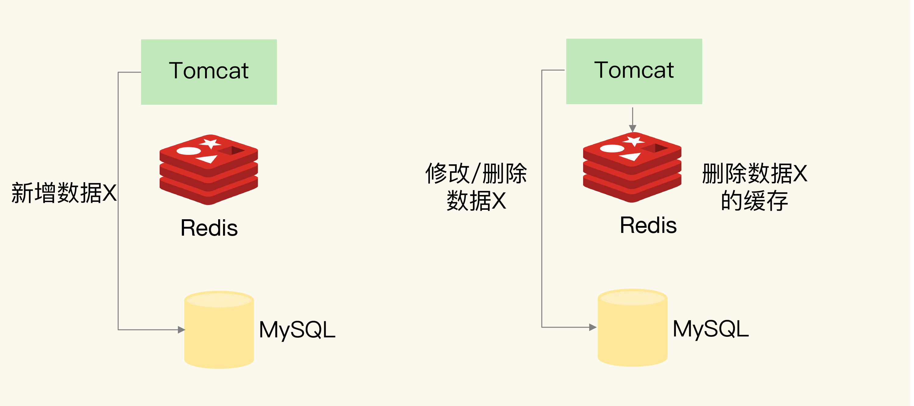
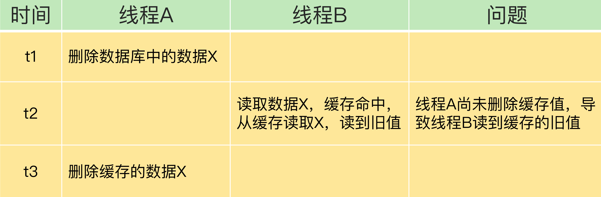
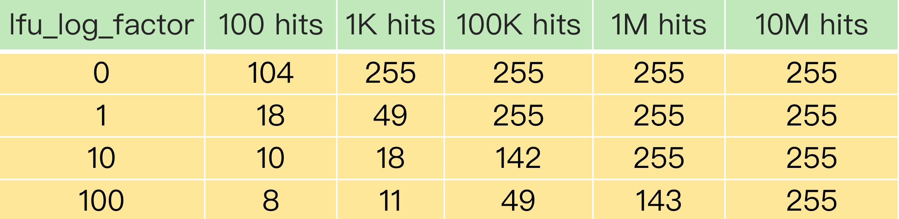

[TOC]

# 缓存场景应用

Redis 用作缓存的普遍性以及它在业务应用中的重要作用，所以，我们需要系统地掌握缓存的一系列内容，包括工作原理、替换策略、异常处理和扩展机制。具体来说，我们需要解决四个关键问题：

- Redis 缓存具体是怎么工作的？
- Redis 缓存如果满了，该怎么办？
- 为什么会有缓存一致性、缓存穿透、缓存雪崩、缓存击穿等异常，该如何应对？
- Redis 的内存毕竟有限，如果用快速的固态硬盘来保存数据，可以增加缓存的数据量，那么，Redis 缓存可以使用快速固态硬盘吗？

## 一. 缓存特征

- 在一个层次化的系统中，缓存一定是一个快速子系统，数据存在缓存中时，能避免每次从慢速子系统中存取数据。对应到互联网应用来说，Redis 就是快速子系统，而数据库就是慢速子系统了。

- 缓存系统的容量大小总是小于后端慢速系统的，我们不可能把所有数据都放在缓存系统中。所以缓存中的数据需要按一定规则淘汰出去，写回后端系统，而新的数据又要从后端系统中读取进来，写入缓存。

## 二. Redis 缓存处理请求的两种情况

- **缓存命中**：Redis 中有相应数据，就直接读取 Redis，性能非常快。
- **缓存缺失**：Redis 中没有保存相应数据，就从后端数据库中读取数据，性能就会变慢。而且，一旦发生缓存缺失，为了让后续请求能从缓存中读取到数据，我们需要把缺失的数据写入 Redis，这个过程叫作缓存更新。缓存更新操作会涉及到保证缓存和数据库之间的数据一致性问题.


## 三. 缓存类型

- 只读缓存


- 读写缓存

  - **同步直写**策略**: 写请求发给缓存的同时，也会发给后端数据库进行处理，等到缓存和数据库都写完数据，才给客户端返回。
  - **异步写回策略**: 则是优先考虑了响应延迟。此时，所有写请求都先在缓存中处理。等到这些增改的数据要被从缓存中淘汰出来时，缓存将它们写回后端数据库。


## 四. 缓存数据的淘态策略

1. 根据一定的策略，筛选出对应用访问来说“不重要”的数据；

2. 将这些数据从缓存中删除，为新来的数据腾出空间

### a. 设置多大的缓存容量合适?

这个容量规划不能一概而论，是需要结合**应用数据实际访问特征和成本开销来综合考虑的。**

大容量缓存是能带来性能加速的收益，但是成本也会更高，而小容量缓存不一定就起不到加速访问的效果。一般来说，**我会建议把缓存容量设置为总数据量的 15% 到 30%，兼顾访问性能和内存空间开销。**

> 以下命令来设定缓存的大小
>
> ```shell
> #  命令来设定缓存的大小
> $ CONFIG SET maxmemory 4gb
> ```

但是**缓存被写满是不可必免的**.

### b. 缓存的淘汰策略

- 不进行淘汰: `no-eviction`: 禁止驱逐数据(**默认策略**),当内存不足以容纳新入数据时,新写入会报错,读请求继续进行.
- 进行淘汰
  - 设置了过期时间的数据中进行淘汰
    - `volatile-random`: 从已设置了过期时间的键值对中，进行随机删除
    - `volatile-ttl`: 从已设置了过期时间的键值对，根据过期时间的先后进行删除，越早过期的越先被删除。
    - `volatile-lru`:  LRU 算法筛选, 从已设置过期时间的数据集中挑选最近最少使用的数据淘汰
    - `volatile-lfu`:  LFU 算法筛选,从已设置过期时间的数据集挑选使用频率最低的数据淘汰。
  - 所有数据范围内进行淘汰
    - `allkeys-random`: 从所有键值对中随机选择并删除数据
    - `allkeys-lru`: LRU 算法筛选,在所有数据中进行筛选。
    - `allkeys-lfu`: LFU 算法筛选, 在所有数据中进行筛选

> 在 Redis 中，LRU 算法被做了简化，以减轻数据淘汰对缓存性能的影响。
>
> 具体来说，Redis 默认会记录每个数据的最近一次访问的时间戳(由键值对数据结构 RedisObject 中的 lru 字段记录)。
>
> 然后，Redis 在决定淘汰的数据时，第一次会随机选出 N 个数据，把它们作为一个候选集合。
>
> 接下来，Redis 会比较这 N 个数据的 lru 字段，把 lru 字段值最小的数据从缓存中淘汰出去.
>
> Redis 提供了一个配置参数 `maxmemory-samples`，这个参数就是 Redis 选出的数据个数 N.
>
> `CONFIG SET maxmemory-samples 100`
> 
> 
>
> 当需要再次淘汰数据时，Redis 需要挑选数据进入第一次淘汰时创建的候选集合。这儿的挑选标准是：
>
> **能进入候选集合的数据的 lru 字段值必须小于候选集合中最小的 lru 值**
>
> - 优先使用 `allkeys-lru` 策略。这样，可以充分利用 LRU 这一经典缓存算法的优势，把最近最常访问的数据留在缓存中，提升应用的访问性能。如果你的业务数据中有明显的冷热数据区分，我建议你使用 `allkeys-lru` 策略。
> - 如果业务应用中的数据访问频率相差不大，没有明显的冷热数据区分，建议使用 `allkeys-random `策略，随机选择淘汰的数据就行
> - 如果你的业务中有置顶的需求，比如置顶新闻、置顶视频，那么，可以使用 `volatile-lru`策略，同时不给这些置顶数据设置过期时间。这样一来，这些需要置顶的数据一直不会被删除，而其他数据会在过期时根据 LRU 规则进行筛选。

### c. 淘汰机制实现

- **删除失效主键**

  - **消极方法(passive way)**: 在主键被访问时如果发现它已经失效，那么就删除它
  - **积极方法(active way)**: 周期性地探测，发现失效就删除。消极方法的缺点是，如果key 迟迟不被访问，就会占用很多内存空间，所以才有积极方式。
  - **主动删除**：当内存超过maxmemory限定时，触发主动清理策略，该策略由启动参数的配置决定

- **淘汰数据的量**: 为了避免频繁的触发淘汰策略，每次会淘汰掉一批数据，淘汰的数据的大小其实是和置换的大小来确定的，如果置换的数据量大，淘汰的肯定也多。

- **置换策略是如何工作**

  > 1. 客户端执行一条新命令，导致数据库需要增加数据(比如set key value)
  >
  > 2. Redis会检查内存使用，如果内存使用超过maxmemory，就会按照置换策略删除一些key
  >
  > 3. 新的命令执行成功

## 五. 缓存异常

### a. 缓存一致性

> - 缓存中有数据，那么，缓存的数据值需要和数据库中的值相同；
>
> - 缓存中本身没有数据，那么，数据库中的值必须是最新值



> 1. 新增数据
>
> 如果是新增数据，数据会直接写到数据库中，不用对缓存做任何操作，此时，缓存中本身就没有新增数据，而数据库中是最新值
>
> 2. 删改数据
>
> 
>
>  - 先删除缓存，再更新数据库
>
>    
>
>  - 先更新数据库值，再删除缓存值
>
>    

### b. 缓存一致性总结

> 

当一个系统引入缓存时，需要面临最大的问题就是，如何保证缓存和后端数据库的一致性问题，最常见的3个解决方案分别是`Cache Aside`、`Read/Write Throught`和`Write Back`缓存更新策略。

- `Cache Aside策略`：就是文章所讲的只读缓存模式。读操作命中缓存直接返回，否则从后端数据库加载到缓存再返回。写操作直接更新数据库，然后删除缓存。这种策略的优点是一切以后端数据库为准，可以保证缓存和数据库的一致性。缺点是写操作会让缓存失效，再次读取时需要从数据库中加载。这种策略是我们在开发软件时最常用的，在使用Memcached或Redis时一般都采用这种方案。

- `Read/Write Throught策略`：应用层读写只需要操作缓存，不需要关心后端数据库。应用层在操作缓存时，缓存层会自动从数据库中加载或写回到数据库中，这种策略的优点是，对于应用层的使用非常友好，只需要操作缓存即可，缺点是需要缓存层支持和后端数据库的联动。

- `Write Back策略`：类似于文章所讲的读写缓存模式+异步写回策略。写操作只写缓存，比较简单。而读操作如果命中缓存则直接返回，否则需要从数据库中加载到缓存中，在加载之前，如果缓存已满，则先把需要淘汰的缓存数据写回到后端数据库中，再把对应的数据放入到缓存中。这种策略的优点是，写操作飞快(只写缓存)，缺点是如果数据还未来得及写入后端数据库，系统发生异常会导致缓存和数据库的不一致。这种策略经常使用在操作系统Page Cache中，或者应对大量写操作的数据库引擎中。

>  除了以上提到的缓存和数据库的更新策略之外，还有一个问题就是操作缓存或数据库发生异常时如何处理？例如缓存操作成功，数据库操作失败，或者反过来，还是有可能会产生不一致的情况。
>
> 比较简单的解决方案是，根据业务设计好更新缓存和数据库的先后顺序来降低影响，或者给缓存设置较短的有效期来降低不一致的时间。
>
> 如果需要严格保证缓存和数据库的一致性，即保证两者操作的原子性，这就涉及到分布式事务问题了，常见的解决方案就是我们经常听到的***两阶段提交(2PC)***、***三阶段提交(3PC)***、***TCC***、***消息队列***等方式来保证了，方案也会比较复杂，一般用在对于***一致性要求较高***的业务场景中

### c. 缓存雪崩、缓存击穿、缓存穿透

- **缓存雪崩**: 缓存雪崩是指大量的应用请求无法在 Redis 缓存中进行处理，紧接着，应用将大量请求发送到数据库层，导致数据库层的压力激增

> 1. 缓存中有大量数据同时过期，导致大量请求无法得到处理
> 2. Redis 缓存实例发生故障宕机了，无法处理请求，这就会导致大量请求一下子积压到数据库层，从而发生缓存雪崩
>
> 应对方案:
>
> 1. 服务降级
>
> > - 当业务应用访问的是非核心数据（例如电商商品属性）时，暂时停止从缓存中查询这些数据，而是直接返回预定义信息、空值或是错误信息；
> > - 当业务应用访问的是核心数据（例如电商商品库存）时，仍然允许查询缓存，如果缓存缺失，也可以继续通过数据库读取。
>
> 2. 业务系统中实现服务熔断或请求限流机制
>
> > **所谓的服务熔断**，是指在发生缓存雪崩时，为了防止引发连锁的数据库雪崩，甚至是整个系统的崩溃，我们暂停业务应用对缓存系统的接口访问。再具体点说，就是业务应用调用缓存接口时，缓存客户端并不把请求发给 Redis 缓存实例，而是直接返回，等到 Redis 缓存实例重新恢复服务后，再允许应用请求发送到缓存系统。
>
> 3. 事前预防
>
> > 通过主从节点的方式构建 Redis 缓存高可靠集群。如果 Redis 缓存的主节点故障宕机了，从节点还可以切换成为主节点，继续提供缓存服务，避免了由于缓存实例宕机而导致的缓存雪崩问题。

- **缓存击穿**: 针对某个访问非常频繁的热点数据的请求，无法在缓存中进行处理，紧接着，访问该数据的大量请求，一下子都发送到了后端数据库，导致了数据库压力激增，会影响数据库处理其他请求.

  > 

- **缓存穿透**: 指要访问的数据既不在 Redis 缓存中，也不在数据库中，导致请求在访问缓存时，发生缓存缺失，再去访问数据库时，发现数据库中也没有要访问的数据.

  > - 第一种方案是，缓存空值或缺省值
  > - 第二种方案是，使用布隆过滤器快速判断数据是否存在，避免从数据库中查询数据是否存在，减轻数据库压力。

### d. 缓存雪崩、缓存击穿、缓存穿透 总结


## 六. 缓存污染

缓存污染问题指的是留存在缓存中的数据，实际不会被再次访问了，但是又占据了缓存空间。如果这样的数据体量很大，甚至占满了缓存，每次有新数据写入缓存时，还需要把这些数据逐步淘汰出缓存，就会增加缓存操作的时间开销。

### a. LFU策略

LFU 策略中会从两个维度来筛选并淘汰数据：一是: **数据访问的时效性（访问时间离当前时间的远近）**; 二是: **数据的被访问次数。**

> LFU 缓存策略是在 LRU 策略基础上，为每个数据增加了一个计数器，来统计这个数据的访问次数。
>
> 当使用 LFU 策略筛选淘汰数据时，首先会根据数据的访问次数进行筛选，把访问次数最低的数据淘汰出缓存。
>
> 如果两个数据的访问次数相同，LFU 策略再比较这两个数据的访问时效性，把距离上一次访问时间更久的数据淘汰出缓存。

> Redis 在实现 LRU 策略时使用了两个近似方法：Redis 是用 RedisObject 结构来保存数据的，RedisObject 结构中设置了一个 lru 字段，用来记录数据的访问时间戳；Redis 并没有为所有的数据维护一个全局的链表，而是通过随机采样方式，选取一定数量（例如 10 个）的数据放入候选集合，后续在候选集合中根据 lru 字段值的大小进行筛选。

> Redis 在实现 LFU 策略的时候，只是把原来 24bit 大小的 lru 字段，又进一步拆分成了两部分。
>
> - ldt 值：lru 字段的前 16bit，表示数据的访问时间戳；
>
> - counter 值：lru 字段的后 8bit，表示数据的访问次数。
>
>   > LFU 策略实现的计数规则是：每当数据被访问一次时，首先，用计数器当前的值乘以配置项 `lfu_log_factor `再加 1，再取其倒数，得到一个 p 值；然后，把这个 p 值和一个取值范围在（0，1）间的随机数 r 值比大小，只有 p 值大于 r 值时，计数器才加 1。
>   >
>   > ```c
>   > double r = (double)rand()/RAND_MAX;
>   > double p = 1.0/(baseval*server.lfu_log_factor+1);
>   > if (r < p) counter++;   
>   > ```
>
>   
>
>   > LFU 策略使用衰减因子配置项 `lfu_decay_time` 来控制访问次数的衰减。
>   >
>   > LFU 策略会计算当前时间和数据最近一次访问时间的差值，并把这个差值换算成以分钟为单位。
>   >
>   > 然后，LFU 策略再把这个差值除以` lfu_decay_time` 值，所得的结果就是数据 counter 要衰减的值。