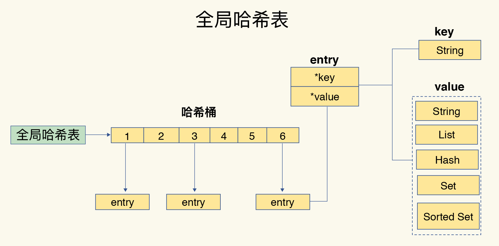
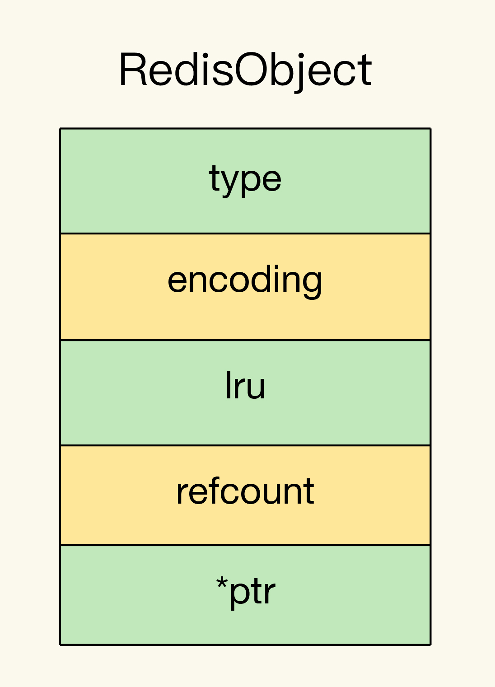

[TOC]

# redis数据结构

## redis基础类型 

| 数据类型     | 底层数据结构      |
| ------------ | ----------------- |
| `String`     | 简单动态字符串    |
| `List`       | 双向链表,压缩列表 |
| `Hash`       | 哈希表,压缩列表   |
| `Sorted Set` | 跳表,压缩列表     |
| `Set`        | 整数数组,哈希表   |

## 数据结构的时间复杂度

| 名称     | 时间复杂度 |
| -------- | ---------- |
| 哈希表   | O(1)       |
| 跳表     | O(logN)    |
| 双向链表 | O(N)       |
| 压缩列表 | O(N)       |
| 整数数组 | O(N)       |

## redis 线程模型

1.redis真的只有单线程吗？ 

​	单线程是指网络io和数据读写操作是由一个线程完成的。数据清理，持久化，主从复制也使用到了其他线程。 

2.为什么使用单线程？

​	避免多线程开发的并发控制问题，且多线程开发代码复杂，可维护性差。 

3.单线程为什么这么快？ 

​	内存+高效的数据结构+io多路复用

## redis全局哈希表

### a. Dict Entry

### b. Redis Object

**RedisObject**内部组成包括了**元数据**和**数据指针**。

- **元数据**包括 `type`、`encoding`、`lru` 和 `refcount` 4 个

  - **type**：表示值的类型，涵盖了五大基本类型；
  - **encoding**：是值的编码方式，用来表示 Redis 中实现各个基本类型的底层数据结构，例如 SDS、压缩列表、哈希表、跳表等；
  - **lru**：记录了这个对象最后一次被访问的时间，用于淘汰过期的键值对；
  - **refcount**：记录了对象的引用计数；

- **数据指针**

  - `Long类型整数数据`: **RedisObject** 中的指针就直接赋值为整数数据了，这样就不用额外的指针再指向整数了，节省了指针的空间开销
  - `字符串数据`
    - **字符串小于等于44字节**时，**RedisObject** 中的元数据、指针和 SDS 是一块连续的内存区域，这样就可以避免内存碎片。这种布局方式也被称为 `embstr编码模式`。
    - **字符串大于 44 字节**时，SDS 的数据量就开始变多了，Redis 就不再把 **SDS** 和 **RedisObject** 布局在一起了，而是会给 SDS 分配独立的空间，并用指针指向 SDS 结构。这种布局方式被称为 `raw编码模式`。

  - RedisObject数据的编码方式

## Redis容量预估

[Redis容量预估](http://www.redis.cn/redis_memory/)

