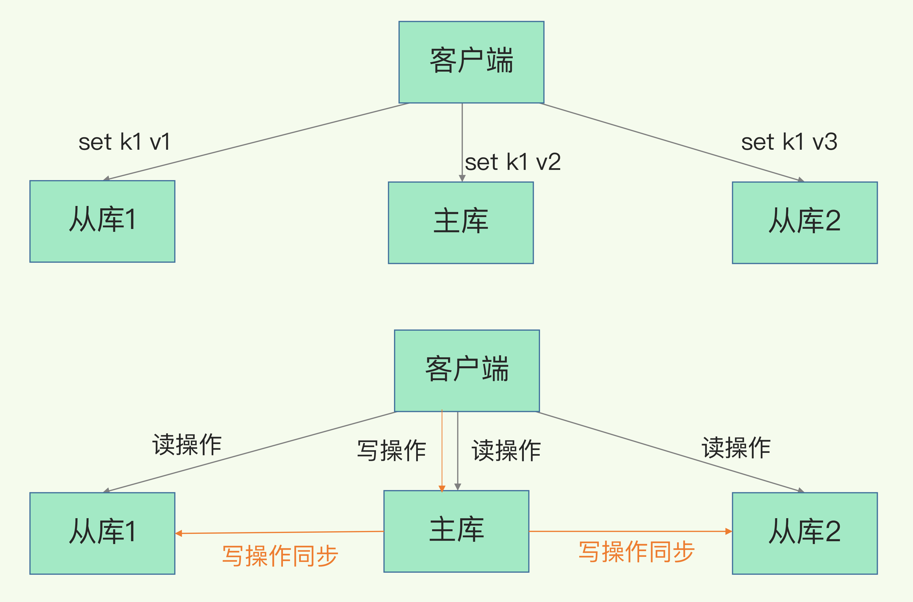

[TOC]

# Redis集群

## 一. 集群主从设计

Redis 提供了主从库模式，以保证数据副本的一致，主从库之间采用的是读写分离的方式。

- 读操作：主库、从库都可以接收；
- 写操作：首先到主库执行，然后，主库将写操作同步给从库

## 二. 哨边机制

哨兵其实就是一个运行在特殊模式下的 Redis 进程，主从库实例运行的同时，它也在运行。哨兵主要负责的就是三个任务：监控、选主（选择主库）和通知.

- 监控是指哨兵进程在运行时，周期性地给所有的主从库发送 PING 命令，检测它们是否仍然在线运行。如果从库没有在规定时间内响应哨兵的 PING 命令，哨兵就会把它标记为“下线状态”；同样，如果主库也没有在规定时间内响应哨兵的 PING 命令，哨兵就会判定主库下线，然后开始自动切换主库的流程.
- 选主。主库挂了以后，哨兵就需要从很多个从库里，按照一定的规则选择一个从库实例，把它作为新的主库。这一步完成后，现在的集群里就有了新主库。
- 通知。在执行通知任务时，哨兵会把新主库的连接信息发给其他从库，让它们执行 replicaof 命令，和新主库建立连接，并进行数据复制。同时，哨兵会把新主库的连接信息通知给客户端，让它们把请求操作发到新主库上。

