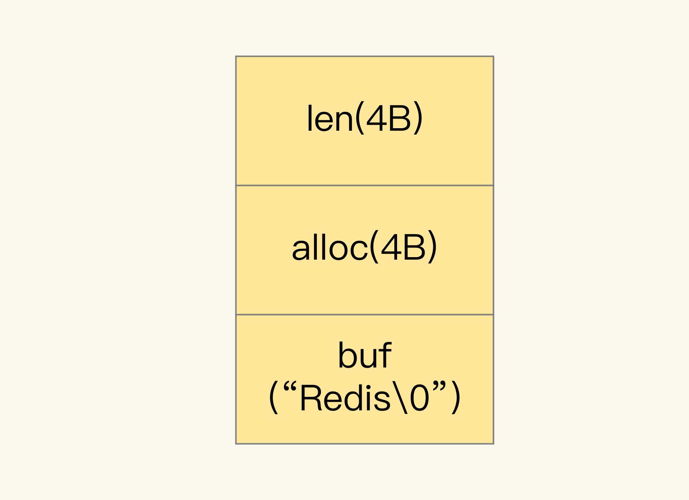

[TOC]

# string

## 1. string具体数据类型

`String类型`就会用简单动态字符串（Simple Dynamic String，SDS）结构体来保存.

- **len**：占 4 个字节，表示 buf 的已用长度。
- **alloc**：也占个 4 字节，表示 buf 的实际分配长度，一般大于 len
- **buf**：字节数组，保存实际数据。为了表示字节数组的结束，Redis 会自动在数组最后加一个“\0”，这就会额外占用 1 个字节的开销。

