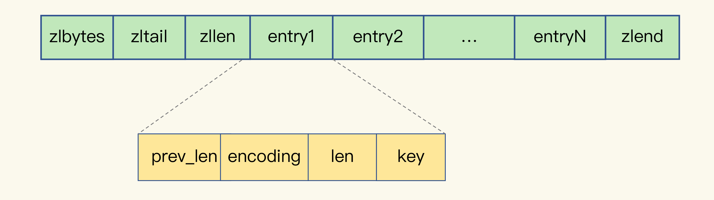

[TOC]

# ziplist

## 1. ziplist数据结构

表头有三个字段 `zlbytes`(长度)、`zltail`(列表尾的偏移量) 和 `zllen`(列表中的 entry 个数)。

压缩列表尾还有一个 `zlend`，表示列表结束

### a. ziplist的entry数据结构

- **prev_len**，表示前一个 entry 的长度。prev_len 有两种取值情况：1字节或 5字节。取值 1 字节时，表示上一个 entry 的长度小于 254 字节。虽然 1 字节的值能表示的数值范围是 0 到 255，但是压缩列表中 zlend 的取值默认是 255，因此，就默认用 255 表示整个压缩列表的结束，其他表示长度的地方就不能再用 255 这个值了。所以，当上一个 entry 长度小于 254 字节时，prev_len 取值为 1 字节，否则，就取值为 5 字节。
- **encoding**：表示编码方式, 1字节；
- **len**：表示自身长度,  4 字节；
- **content**：保存实际数据。

### b. hash使用哈希集合或压缩列表的阀值

- **hash-max-ziplist-entries**：表示用压缩列表保存时哈希集合中的最大元素个数
- **hash-max-ziplist-value**：表示用压缩列表保存时哈希集合中单个元素的最大长度

> 如果我们往 Hash 集合中写入的元素个数超过了 **hash-max-ziplist-entries**，或者写入的单个元素大小超过了 **hash-max-ziplist-value**，Redis 就会自动把 Hash 类型的实现结构由压缩列表转为哈希表

