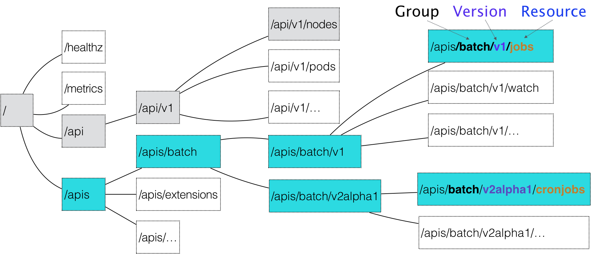

# 声明式API原理

在 Kubernetes 项目中，一个 API 对象在 Etcd 里的完整资源路径，是由三个部分组成：

- `Group`（API 组）
- `Version`（API 版本）
- `Resource`（API 资源类型）

Kubernetes 是如何对 Resource、Group 和 Version 进行解析: 

- Kubernetes 会匹配 API 对象的组。

  >  核心API对象,如Pod, Node等就不需要Group,默认为"",在`/api`下找
  >
  > 非核心对象,根据对应组,比如`batch/v1`,`batch`就是组名,将在`/apis`下找

- Kubernetes 会进一步匹配到 API 对象的版本号
- Kubernetes 会匹配 API 对象的资源类型.即`Kind`