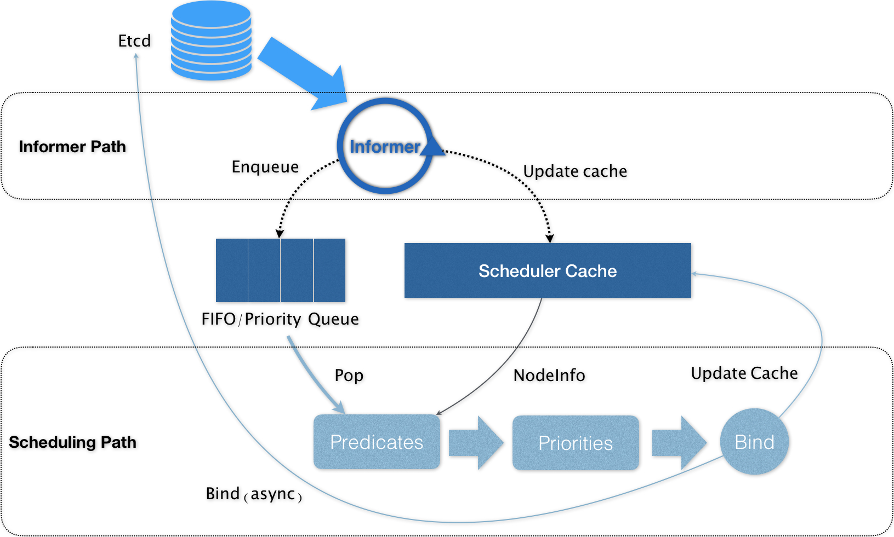

# 调试器

在 Kubernetes 项目中，默认调度器的主要职责，就是为一个新创建出来的 Pod，寻找一个最合适的节点（Node）。

- 默认调度器会首先调用一组叫作 Predicate 的调度算法，来检查每个 Node。
- 然后，再调用一组叫作 Priority 的调度算法，来给上一步得到的结果里的每个 Node 打分。
- 最终的调度结果，就是得分最高的那个 Node。



Kubernetes 的调度器的核心，实际上就是两个相互独立的控制循环。

- **第一个控制循环，我们可以称之为 Informer Path。** 它的主要目的，是启动一系列 Informer，用来监听（Watch）Etcd 中 Pod、Node、Service 等与调度相关的 API 对象的变化.
- **第二个控制循环，是调度器负责 Pod 调度的主循环，我们可以称之为 Scheduling Path。**Scheduling Path 的主要逻辑，就是不断地从调度队列里出队一个 Pod。然后，调用 Predicates 算法进行“过滤”。这一步“过滤”得到的一组 Node，就是所有可以运行这个 Pod 的宿主机列表。

接下来，调度器就会再调用 Priorities 算法为上述列表里的 Node 打分，分数从 0 到 10。得分最高的 Node，就会作为这次调度的结果。  
调度算法执行完成后，调度器就需要将 Pod 对象的 nodeName 字段的值，修改为上述 Node 的名字。 **这个步骤在 Kubernetes 里面被称作 Bind。**

## Predicates

Predicates 在调度过程中的作用，可以理解为 Filter，即：它按照调度策略，从当前集群的所有节点中，“过滤”出一系列符合条件的节点。这些节点，都是可以运行待调度 Pod 的宿主机

Kubernetes 中，默认的调度策略有如下三种:

- 第一种类型，叫作 **GeneralPredicates** ,负责的是最基础的调度策略。比如，PodFitsResources 计算的就是宿主机的 CPU 和内存资源等是否够用.
- 第二种类型，是与 **Volume 相关的过滤规则** ,一组过滤规则，负责的是跟容器持久化 Volume 相关的调度策略。
  - NoDiskConflict 检查的条件，是多个 Pod 声明挂载的持久化 Volume 是否有冲突.
  - MaxPDVolumeCountPredicate 检查的条件，则是一个节点上某种类型的持久化 Volume 是不是已经超过了一定数目，如果是的话，那么声明使用该类型持久化 Volume 的 Pod 就不能再调度到这个节点了。
  - VolumeZonePredicate，则是检查持久化 Volume 的 Zone（高可用域）标签，是否与待考察节点的 Zone 标签相匹配。
  - VolumeBindingPredicate 的规则。它负责检查的，是该 Pod 对应的 PV 的 nodeAffinity 字段，是否跟某个节点的标签相匹配。
- 第三种类型，是 **宿主机相关的过滤规则.** ,主要考察待调度 Pod 是否满足 Node 本身的某些条件。
  - PodToleratesNodeTaints，负责检查的就是我们前面经常用到的 Node 的“污点”机制。只有当 Pod 的 Toleration 字段与 Node 的 Taint 字段能够匹配的时候，这个 Pod 才能被调度到该节点上。
  - NodeMemoryPressurePredicate，检查的是当前节点的内存是不是已经不够充足，如果是的话，那么待调度 Pod 就不能被调度到该节点上。

- 第四种类型，是 **Pod 相关的过滤规则.** PodAffinityPredicate。这个规则的作用，是检查待调度 Pod 与 Node 上的已有 Pod 之间的亲密（affinity）和反亲密（anti-affinity）关系.

上面这四种类型的 Predicates，就构成了调度器确定一个 Node 可以运行待调度 Pod 的基本策略。  
**在具体执行的时候， 当开始调度一个 Pod 时，Kubernetes 调度器会同时启动 16 个 Goroutine，来并发地为集群里的所有 Node 计算 Predicates，最后返回可以运行这个 Pod 的宿主机列表.**

## Priorities

Priorities 阶段的工作就是为这些节点打分。这里打分的范围是 0-10 分，得分最高的节点就是最后被 Pod 绑定的最佳节点。

LeastRequestedPriority: 

```
# 选择空闲资源（CPU 和 Memory）最多的宿主机。
score = (cpu((capacity-sum(requested))10/capacity) + memory((capacity-sum(requested))10/capacity))/2
```

BalancedResourceAllocation:

```
# 每种资源的 Fraction 的定义是: Pod 请求的资源 / 节点上的可用资源。  
# 而 variance 算法的作用，则是计算每两种资源 Fraction 之间的“距离”。  
# 而最后选择的，则是资源 Fraction 差距最小的节点。
score = 10 - variance(cpuFraction,memoryFraction,volumeFraction)*10
```

**在实际的执行过程中，调度器里关于集群和 Pod 的信息都已经缓存化，所以这些算法的执行过程还是比较快的。**