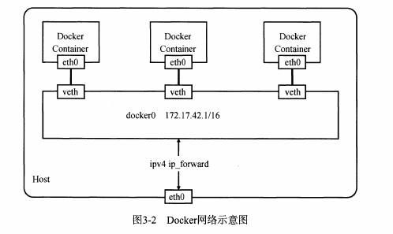

[toc]

# Docker核心原理解读

`Docker` 是利用 Linux 的 `Namespace` 、`Cgroups` 和`联合文件系统`三大机制来保证实现的， 所以它的原理是

- `Namespace` 做主机名、网络、PID 等资源的隔离，
- `Cgroups`对进程或者进程组做资源（例如：CPU、内存等）的限制，
- `联合文件系统`用于镜像构建和容器运行环境

## Docker背后的Linux内核知识

### 1 `namespace` 资源隔离

Linux提供了6种`namespace`隔离的系统调用.

| namespace   | 系统调用flags | 隔离内容                  | 内核版本 |
| :---------- | ------------- | ------------------------- | -------- |
| **UTS**     | CLONE_NEWUTS  | 主机名与域名              | 2.4.19   |
| **IPC**     | CLONE_NEWIPC  | 信号量,消息队列和共享内存 | 2.6.24   |
| **PID**     | CLONE_NEWPID  | 进程编号                  | 2.6.29   |
| **Network** | CLONE_NEWNET  | 网络设备,网络栈,端口等    | 2.6.19   |
| **Mount**   | CLONE_NEWNS   | 挂载点(文件系统)          | 2.6.19   |
| **User**    | CLONE_NEWUSER | 用户和用户组              | 3.8      |

Lniux内核实现`namespace`的一个主要目的,就是实现轻量级虚拟化(容器)服务.  
在同一个`namespace`下的进程可以感知彼此的变化,而对外界的进程一无所知,使容器中的进程产生错觉,仿佛置身于一个独立的系统环境中,以达到独立和隔离的目的.  
所讨论的`namespce`实现针对的均是Linux内核3.8及以后的版本.

#### 1.1 `namespace` API操作的4种方式.

`namespace`的API包括`clone()`,`setns()`以及`unshare()`,还有`/proc`下的部份文件,为了确定隔离的到底是哪几项`namespace`,可以采用6个参数中的一个或多个`|`(位或)的方式实现.

- 通过`clone()`在创建新进程的同时创建`namespace`

```c
// clild_func 传入子进程运行的程序主函数
// clild_stack 传入子进程使用的栈空间
// flags表示使用哪些CLONE_*标志位,与namespace有上面提到的六种隔离标志
// args则可以传入用户参数
int clone(int (*child_func)(void *), void *clild_stack, int flags, vold *arg);
```

- 查看`/proc/{pid}/ns`文件

```shell
# $$是shell中表示当前运行的进程ID号
$ ls -l /proc/$$/ns
total 0
lrwxrwxrwx 1 root root 0 8月   2 20:21 cgroup -> 'cgroup:[4026531835]'
lrwxrwxrwx 1 root root 0 8月   2 20:21 ipc -> 'ipc:[4026531839]'
lrwxrwxrwx 1 root root 0 8月   2 20:21 mnt -> 'mnt:[4026531840]'
lrwxrwxrwx 1 root root 0 8月   2 20:21 net -> 'net:[4026532008]'
lrwxrwxrwx 1 root root 0 8月   2 20:21 pid -> 'pid:[4026531836]'
lrwxrwxrwx 1 root root 0 8月   2 20:21 pid_for_children -> 'pid:[4026531836]'
lrwxrwxrwx 1 root root 0 8月   2 20:21 user -> 'user:[4026531837]'
lrwxrwxrwx 1 root root 0 8月   2 20:21 uts -> 'uts:[4026531838]'
```

> 如果两个进程指向的`namespace`编号相同,就说明他们在同一个`namespace`下,否则便在不同的`namespace`里面.
>
>  `/proc/[pid]/ns`里设置这些Link的另外一个作用是,一旦上述Link文件被 打开,只要打开的文件描述符(fd)存在,那么就算该`namespace`下的所有进程都已经结束,这个`namespace`也会一直存在,后续进程也可以再加入来.  
> ​在Docker中,通过文件描述符定位和加入一个存在的`namespace`是最基本的方式.

- 通过`setns()`加入一个已经存在的`namespace`

​    在进程都结束的情况下,也可以通过挂载的形式把`namespace`保留下来,保留`namespace`的目的是为以后有进程加入做准备 .  
​    在Docker中,使用`docker exec`命令在已经运行着的容器中执行一个新的命令,就需要用到该方法,通过`setns()`加入已存在的`namespace`.  

```c
 // fd表示要加入namespace的文件描述符,上文提到,它指向一个`/proc/[pid]/ns`目录的文件描述符.
 // nstype让调用者可以检查fd指向的namespace类型是否符合实际要求,该参数为0表示不检查. 
int setns(int fd,int nstype)
```

- 通过`unshare()`在原先进程上进行`namespace`隔离

`unshare()`运行在原先的进程上,不需要启动一个新进程.相当于跳出原先的`namespace`进行操作.Docker目前并没有使用这个系统调用.

```c
int unshare(int flags);
```

#### 1.2 UTS namespace

 `UTS(UNIX Time-sharing System) namespace`提供了**主机名**与**域名**的隔离,这样每个Docker容器就可以独有独立的主机名和域名了,在网络上可以被视为一个独立的节点,而非宿主机上的一个进程.   
​    在Docker中,每个镜像基本都以自身所提供的服务名称来命名镜像的hostname且不会对宿主机产生任何影响,其原理就是利用了`UTS namespace`.  

#### 1.3 IPC namespace

进程间通信(`Inter-Process Communication, IPC`)涉及的IPC资源包括常见的信号量,消息队列,共享内存.申请IPC资源就申请了一个全局唯一的32位ID,所以`IPC namespace`中实际上包含了系统IPC标识符以及实现POSIX消息队列的文件系统.

#### 1.4 PID namespace

`PID namespace`隔离非常实用,它对进程PID重新标号,即两个不同`namespace`下的进程可以有相同的PID.   
每个`PID namespace`都有自己的计数程序. 内核为所有`PID namespace`维护了一个树状结构,最顶层的是系统初始时创建的,被称为root namespace.它创建的新PID namespace被称为child namespace(树的子节点).和原来的PID namespace就是新创建的PID namespace的parent namespace(树的父节点.)

- 每个PID namespace中第一个进程"PID 1"都会像传统Linux中的init进程一样拥有特权,起特殊作用.
- 一个namespace中的进程,不可以通过kill或ptrace影响父节点或者兄弟节点中的进程,因为其它节点的PID在这个namespace中没有任何意义.
- 如果你在新的PID namespace中重新挂载`/proc`文件系统,会发现其下只显示同属一个PID namespace中的其它进程.
- 在root namespace中可以看到所有的进程,并且递归包含所有子节点中的进程.

##### 1.4.1 PID namespace中的init进程

在要实现的容器中,启动的第一个进程也需要实现类现init的功能,维护所有后续启动进程的运行状态.所以确实需要在一个Docker容器中运行多个进程,最先启动的命令进程应该是具有资源监控与回收等管理能力的,如bash.

##### 1.4.2 信号与init进程

内核还为PID namespace中的init进程赋予了其它特权--信号屏蔽. 如果init中没有编写处理某个信号的代码逻辑,那么与init在同一个PID namespace下的进程(即使有超级权限)发送给它的该信号都会被屏蔽. 这个功能的主要作用是防止init进程被误杀.

##### 1.4.3 挂载proc文件系统

如果在新的PID namespace中使用ps命令查看,看到的还是所有的进程,因为与PID直接相关的`/proc`文件系统(procfs)没有挂载到一个与原`/proc`不同的位置.如果只想看到PID namespace本身应该看到的进程,需要重新挂载`/proc`.命令: `mount -t proc proc /proc`

##### 1.4.4 unshare()和setns()

`unshare()`允许用户在原先的进程上建立namespace进行隔离. 但创建了PID namespace后,原选`unshare()`调用进程并不进入新的PID namespace,而是接下来创建的子进程才会进入新的namespace,这个新的子进程成为新namespace中的init进程.
类似,调用`setns()`创建新PID namespace时,调用者进程也不进入新的PID namespace,而是随后创建的子进程进入.

#### 1.5 mount namespace

`mount namespace`通过**隔离文件系统挂载点**对隔离文件系统提供支持.
不同` mount namespace`中文件结构发生变化也互不影响,可通过`/proc/[pid]/mounts`查看到所有挂载在当前namespace中的文件系统,还可以通过`/proc/[pid]/mountstats`看到`mount namespace`中文件设备的统计信息,包括挂载文件的名字,文件系统类型,挂载位置等 .

挂载传播:

- 共享关系(share relationship)
- 从属关系(slave relationship)
- 共享挂载(share)
- 从属挂载(slave)
- 共享/从属挂载(shared and slave)
- 私有挂载(private)
- 不可绑定挂载(unbindable)

#### 1.6 network namespace

Docker daemon在宿主机上负责创建这个veth pair,把一端绑定到docker0网桥上,另一端接入到新建的network space进程中.



#### 1.7 user namespaces

`user namespaces`主要隔离了安全相关的标识符和属性,包括用户ID,用户组ID,root目录,key(指密钥)以及特殊权限.通俗讲,在创建的新进程在新`user namespace`可以拥有不同的用户与用户组.这意味着,在容器外属于一个没有特权的普通用户,但在容器内却拥有所有权限的超级用户.

### 2 `cgroups` 资源隔离

#### 2.1 cgoups是什么 

> `cgroups`是Linux内核提供的一种机制,这种机制可以根据需求把一系列系统任务及其子任务整合(或分隔)到按资源划分等 级的不同组内,从而为系统资源管理提供统一的框架.
> cgroups可以限制,记录任务组所使用的物理资源(包括CPU,Memory,IO,网络等),为容器实现虚拟化提供了基石.
> 在容器的实现中，`Cgroups` 通常用来限制容器的 CPU 和内存等资源的使用。

cgroups特点:

- cgroups的API以一个伪文件系统的方式实现,用户态的程序可以通过文件操作实现cgroups的组织管理.
- cgroups的组织管理操作单元可以细粒度到线程级别,另外用户可以创建和销毁cgroup,从而实现资源再分配和管理
- 所有资源管理的功能都以子系统的方式实现,接口统一
- 子任务创建之初与其父任务处于同一个cgroups的控制组.

本质上来说,`cgroups`是内核附加在程序上的一`系统钩子(hook)`,通过程序运行时对资源的调度触发相应的钩子以达到资源追踪和限制的目的.

#### 2.2 cgroups的作用

> 实现cgroups的主要目的是为了不同用户层面的资源管理,提供一个统一化的接口.
> 从单个任务的资源控制到操作系统层面的虚拟化.

cgroups提供以下四大功能:

- **资源限制**:cgroups可以对任务使用的资源总额进行限制. 如设定应用运行时使用内存的上限,一旦超过这个配额就发出OOM(Out of Memory)提示.
- **优先级分配**:通过分配的CPU时间片数量及磁盘IO带宽大小,实际上就相当于控制任务运行的优先级.
- **资源统计**: cgroups可以统计系统的资源使用量,如CPU使用时长,内存用量等,这个功能非常适用于计费.
- **任务控制**: cgroups可以对任务执行挂起,恢复等操作.

#### 2.3 cgroups 术语表

- **task(任务)**:在cgroups的述语中,任务表示系统的一个进程或线程
- **cgroups(控制组)**: cgroups中的资源控制都以cgroup为单位实现. cgroup表示按某种资源控制票准划分而成的任务组,包含 一个或多个子系统. 一个任务可以加入某个cgroup,也可以从某个cgroup迁移到另外一个cgroup.
- **subsystem(子系统)**: cgroups中的子系统就是一个资源控制调度控制器. 比如cpu子系统可以控制cpu时间分配,内存子系统可以控制cgroup内存使用量.
- **hierarchy(层级)**: 层级由一系统cgroup以一个树状结构排列而成,每个层级通过绑定对应子系统进行资源控制. 层级中的cgroup节点可以包含零或多个子节点,子节点继承父节点挂载的子系统. 整个操作系统可以有多个层级.

#### 2.4 组织结构与基本规则

cgroups,任务,子系统,层级四者间的关系及其基本原则.

- 规则1: 同一个层级可以附加一个或多个子系统. 如图,CPU和Memory的子系统附加到一个层级.
- 规则2: 一个子系统可以附加到多个层级,当且仅当目标层级只有唯一一个子系统时.
- 规则3: 系统每次新建一个层级时,该系统上的所有任务默认加入这个新建层级的初始化cgroup,这个cgroup也被称为root cgroup. 对于创建的每个层级,任务只能存在于其中一个cgroup中,即一个任务不能存在于同一个层级的不同cgroup中,但一个任务可以存在于不同层级中的多个cgroup中. 如果操作时把一个任务添加到同一个层级中的另一个cgroup中,则会将它从第一个cgroup中移除.
- 规则4: 

#### 2.5 子系统简介

#### 2.6 cgroups实现方式及工作原理简介

cgroup的实现本质是给任务挂上钩子,当任务运行的过程中涉及某种资源时,就会触发钩子上所附带的子系统进行检测, 根据资源类别的不同,使用对应的技术进行资源限制和优先级分配

### 3. `UnionFS`联合文件系统

Docker 使用联合文件系统为容器提供构建层，使得容器可以实现写时复制以及镜像的分层构建和存储。常用的联合文件系统有 AUFS、Overlay 和 Devicemapper 等。

