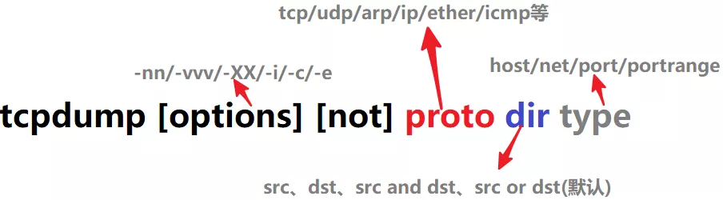

# tcpdump

> 参考:
>
> -  [Linux 网络命令必知必会之 tcpdump，一份完整的抓包指南请查收！](https://www.cnblogs.com/bakari/p/10748721.html)

**tcpdump** 是一款 Linux 平台的抓包工具。它可以抓取涵盖整个 TCP/IP 协议族的数据包，支持针对网络层、协议、主机、端口的过滤，并提供 and、or、not 等逻辑语句来过滤无用的信息。

## 1. tcpdump命令选项

```shell
root@swift:~# tcpdump -h
tcpdump version 4.9.3
libpcap version 1.8.1
OpenSSL 1.1.1  11 Sep 2018
Usage: tcpdump [-aAbdDefhHIJKlLnNOpqStuUvxX#] [ -B size ] [ -c count ]
		[ -C file_size ] [ -E algo:secret ] [ -F file ] [ -G seconds ]
		[ -i interface ] [ -j tstamptype ] [ -M secret ] [ --number ]
		[ -Q in|out|inout ]
		[ -r file ] [ -s snaplen ] [ --time-stamp-precision precision ]
		[ --immediate-mode ] [ -T type ] [ --version ] [ -V file ]
		[ -w file ] [ -W filecount ] [ -y datalinktype ] [ -z postrotate-command ]
		[ -Z user ] [ expression ]
```

> - `-A` 只使用 ASCII 打印报文的全部数据，不要和 `-X` 一起使用，获取 http 可以用 `tcpdump -nSA port 80`
> - `-b` 在数据链路层上选择协议，包括 ip, arp, rarp, ipx 等
> - `-c` 指定**要抓取包的数量**
> - `-D` 列出**操作系统所有可以用于抓包的接口**
> - `-e` **输出链路层报头**
> - `-i `指定**监听的网卡**，`-i any` 显示所有网卡
> - `-n` 表示**不解析主机名**，直接用 IP 显示，默认是用 hostname 显示
> - `-nn` 表示**不解析主机名和端口**，直接用端口号显示，默认显示是端口号对应的服务名
> - `-p` **关闭接口的混杂模式**
> - `-P` 指定**抓取的包是流入的包还是流出的**，可以指定参数 `in`, `out`, `inout` 等，默认是 `inout`
> - `-q` 快速打印输出，即只输出少量的协议相关信息
> - `-s len`设置**要抓取数据包长度为 len**，默认只会截取前 96bytes 的内容，`-s 0` 的话，会截取全部内容。
> - `-S` 将 **TCP 的序列号以绝对值形式输出**，而不是相对值
> - `-t` **不要打印时间戳**
> - `-vv` **输出详细信息**（比如 tos、ttl、checksum等）
> - `-X` 同时用**hex 和 ascii 显示报文内容**
> - `-XX` 同 -X，但**同时显示以太网头部**

## 2. 过滤器

`tcpdump` 提供了灵活的语法可以精确获取我们关心的数据，这些语法说得专业点就是过滤器。

过滤器简单可分为三类：`协议（proto）`,`传输方向（dir）`和`类型（type）`。



- `proto`：可选有 **ip, arp, rarp, tcp, udp, icmp, ether **等，默认是所有协议的包
- `dir`：可选有 **src, dst, src or dst, src and dst**，默认为 src or dst
- `type`：可选有 **host, net, port, portrange**（端口范围，比如 21-42），默认为 host

## 3.tcpdump输出保存成文件

tcpdump 提供了将抓取的数据保存到文件的功能，查看文件就方便分析多了，而且还能与其他图形工具一起配合分析，比如 wireshark、Snort 等。`.pcap` 格式的文件需要用 wireshark、Snort 等工具查看，使用 `vim` 或 `cat` 会出现乱码。

- `-w`选项表示把数据报文输出到文件

```shell
$ tcpdump -w capture_file.pcap port 80 # 把所有 80 端口的数据导出到文件
```

- `-r `选项表示读取文件里的数据报文，显示到屏幕上

```shell
$ tcpdump -nXr capture_file.pcap host host1
```

## tcpdump的输出格式

> 系统时间 源主机.端口 > 目标主机.端口 数据包参数