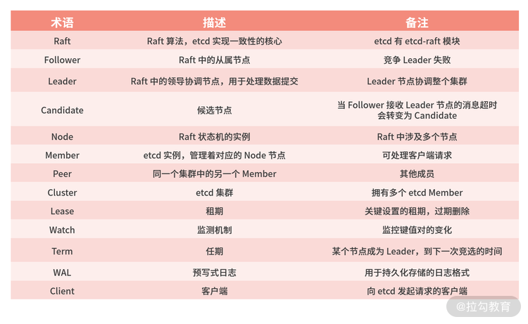
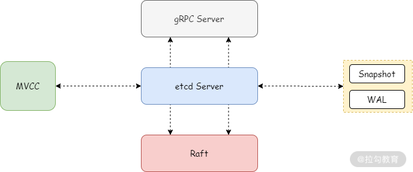
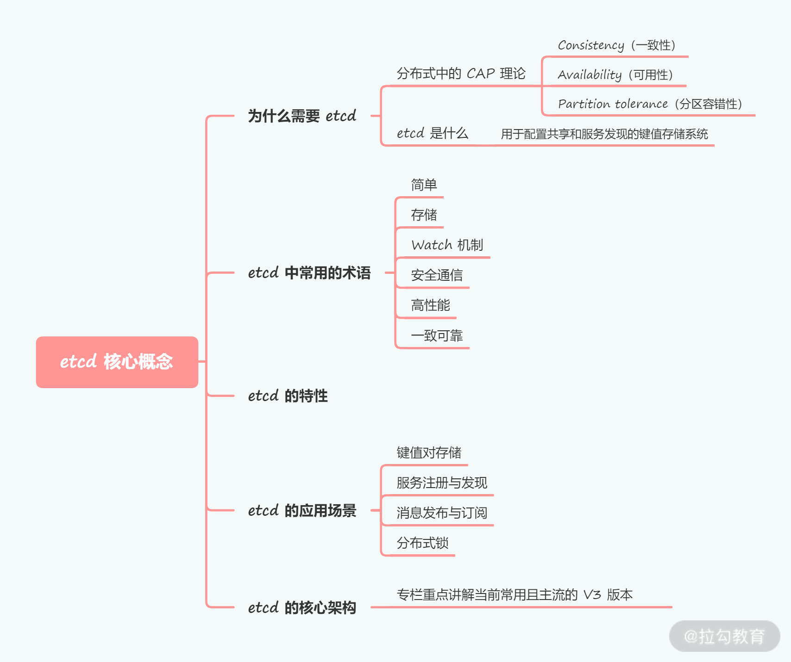

[TOC]

# 基础概念

- `etcd` 是云原生架构中的存储基石，可以有效保证存储数据的一致性和可靠性；

- `etcd `内部实现机制复杂，但是对外提供了简单直接的 API 接口；

- 使用 `etcd `的常见分布式场景包括键值对存储、服务注册与发现、消息订阅与发布、分布式锁等。

## 一. 分布式的CAP理论

CAP 原理是描述分布式系统下节点数据同步的基本定理,这三个要素最多只能同时实现两点，不能三者兼顾。

- `Consistency`(一致性)
- `Availability`(可用性)
-  `Partition tolerance`(分区容错性)

## 二. etcd 中常用的术语

## 三. etcd的核心架构

其中：

- **etcd Server** 用于对外接收和处理客户端的请求；

- **gRPC Server** 则是 etcd 与其他 etcd 节点之间的通信和信息同步；

- **MVCC**，即多版本控制，etcd 的存储模块，键值对的每一次操作行为都会被记录存储，这些数据底层存储在 BoltDB 数据库中；

- **WAL**，预写式日志，etcd 中的数据提交前都会记录到日志；

- **Snapshot 快照**，以防 WAL 日志过多，用于存储某一时刻 etcd 的所有数据；

- **Snapshot** 和 **WAL** 相结合，etcd 可以有效地进行数据存储和节点故障恢复等操作

 ## 四. etcd总结

