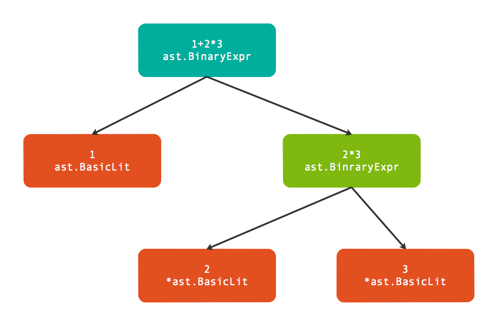

# 3.基础表达式

**基础表达式**是指完全由**数值型面值**和**标识符**组成的表达式.

## 3.1 基础表达式语法

**基础表达式**主要是指由**一元**和**二元**运算符组成的表达式，运算的主体是各种面值或标识符.

```shell
// Expression表示基础表达式的递归定义,可以是UnaryExpr类型的一元表达式，或者是binary_op生成的二元表达式.
// 基础表达式运算符两边的对象由Operand定义,主要是面值或表达式，也可以是由小括弧包含的表达式。
Expression = UnaryExpr | Expression binary_op Expression .
UnaryExpr  = Operand | unary_op UnaryExpr .
Operand    = Literal | identifier | "(" Expression ")" .

binary_op  = "||" | "&&" | rel_op | add_op | mul_op .
rel_op     = "==" | "!=" | "<" | "<=" | ">" | ">=" .
add_op     = "+" | "-" | "|" | "^" .
mul_op     = "*" | "/" | "%" | "<<" | ">>" | "&" | "&^" .

unary_op   = "+" | "-" | "!" | "^" | "*" | "&" | "<-" .
```

## 3.2 解析表达式

`parser.ParseExpr`函数是解析的单个表达式（可以包含注释），因此返回的`ast.Expr`是一个表达式抽象接口：

```go
type Expr interface {
    Node
    // contains filtered or unexported methods
}
```

`st.Node`接口更简单，只有两个方法表示了这个语法树结点的开始位置和结束位置：

```go
type Node interface {
    Pos() token.Pos // position of first character belonging to the node
    End() token.Pos // position of first character immediately after the node
}
```

通过分析`go/ast`包的文档可以发现很多类型以`Expr`为后缀名：

```bash
$ go doc go/ast | grep Expr
type BadExpr struct{ ... }
type BinaryExpr struct{ ... }
type CallExpr struct{ ... }
type Expr interface{ ... }
type ExprStmt struct{ ... }
type IndexExpr struct{ ... }
type KeyValueExpr struct{ ... }
type ParenExpr struct{ ... }
type SelectorExpr struct{ ... }
type SliceExpr struct{ ... }
type StarExpr struct{ ... }
type TypeAssertExpr struct{ ... }
type UnaryExpr struct{ ... }
```

`ast.BinaryExpr`表达的二元算术表达式开始，因为加减乘除四则运算是我们最熟悉的表达式结构：

```go
func main() {
	expr, _ := parser.ParseExpr(`1+2*3`)
	ast.Print(nil, expr)
}
// output:
// 	0  *ast.BinaryExpr {
// 	1  .  X: *ast.BasicLit {
// 	2  .  .  ValuePos: 1
// 	3  .  .  Kind: INT
// 	4  .  .  Value: "1"
// 	5  .  }
// 	6  .  OpPos: 2
// 	7  .  Op: +
// 	8  .  Y: *ast.BinaryExpr {
// 	9  .  .  X: *ast.BasicLit {
//    10  .  .  .  ValuePos: 3
//    11  .  .  .  Kind: INT
//    12  .  .  .  Value: "2"
//    13  .  .  }
//    14  .  .  OpPos: 4
//    15  .  .  Op: *
//    16  .  .  Y: *ast.BasicLit {
//    17  .  .  .  ValuePos: 5
//    18  .  .  .  Kind: INT
//    19  .  .  .  Value: "3"
//    20  .  .  }
//    21  .  }
//    22  }
```

下图是`parser.ParseExpr("1+2*3")`返回的树结构：



其中`ast.BasicLit`是基础面值类型，在前面章节已经讲过。而`ast.BinaryExpr`是表示二元表达式的结点，其定义如下：

```go
type BinaryExpr struct {
    X     Expr        // left operand
    OpPos token.Pos   // position of Op
    Op    token.Token // operator
    Y     Expr        // right operand
}
```

## 3.3 求值表达式

在了解了`ast.BinaryExpr`语法树的结构之后，其实我们就可以手工对表达式求值了：

```go
func main() {
	expr, _ := parser.ParseExpr(`1+2*3`)
	fmt.Println(Eval(expr))
}

func Eval(exp ast.Expr) float64 {
	switch exp := exp.(type) {
	case *ast.BinaryExpr:
		return EvalBinaryExpr(exp)
	case *ast.BasicLit:
		f, _ := strconv.ParseFloat(exp.Value, 64)
		return f
	}
	return 0
}

func EvalBinaryExpr(exp *ast.BinaryExpr) float64 {
	switch exp.Op {
	case token.ADD:
		return Eval(exp.X) + Eval(exp.Y)
	case token.MUL:
		return Eval(exp.X) * Eval(exp.Y)
	}
	return 0
}
```

## 3.4 标识符: 为表达式中引入变量

```go
func main() {
	expr, _ := parser.ParseExpr(`1+2*3+x`)
	fmt.Println(Eval(expr, map[string]float64{
		"x": 100,
	}))
}

func Eval(exp ast.Expr, vars map[string]float64) float64 {
	switch exp := exp.(type) {
	case *ast.BinaryExpr:
		return EvalBinaryExpr(exp, vars)
	case *ast.BasicLit:
		f, _ := strconv.ParseFloat(exp.Value, 64)
		return f
	case *ast.Ident:
		return vars[exp.Name]
	}
	return 0
}

func EvalBinaryExpr(exp *ast.BinaryExpr, vars map[string]float64) float64 {
	switch exp.Op {
	case token.ADD:
		return Eval(exp.X, vars) + Eval(exp.Y, vars)
	case token.MUL:
		return Eval(exp.X, vars) * Eval(exp.Y, vars)
	}
	return 0
}
```

在Eval函数递归解析时，如果当前解析的表达式语法树结点是`*ast.Ident`类型，则直接从`vars`表格查询结果。

不过在Go语言的表达式要复杂很多，不仅仅有普通的局部变量，还有数组索引求值、管道取值、其它结构的成员求值等类型。但是标识符是引入变量最基础的方法，我们可以在此基础方法之上慢慢完善更复杂的求值函数。