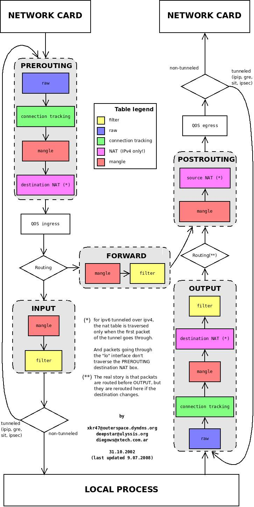

# 1. iptables 

>  参考文章 [iptables详解](http://www.zsythink.net/archives/tag/iptables/page/2/) [备链](https://blog.csdn.net/weixin_33749242/article/details/91718539)

`iptables`其实不是真正的防火墙,我们可以把它理解成一个客户端代理,用户通过`iptables`这个代理,将用户的安全设定执行到对应的"安全框架"中,这个"安全框架"才是真正的防火墙,这个框架的名字叫`netfilter`.

`netfilter`才是防火墙真正的安全框架,`netfilter`位于**内核空间**.

`iptables`其实是一个命令行工具,位于**用户空间**,我们用这个工具操作真正的框架.

`netfilter`是Linux操作系统核心层内部的一个数据包处理模块,它具有如下功能：

- 网络地址转换(Network Address Translate)

- 数据包内容修改

- 以及数据包过滤的防火墙功能

## 1.1 iptables基础

   ` iptables`是按照规则来办事的,所谓规则一般的定义为:

> "如果数据包头符合这样的条件,就这样处理这个数据包".规则存储在内核空间的信息包过滤表中,这些规则分别指定了***源地址***、***目的地址***、***传输协议(如TCP、UDP、ICMP)***和***服务类型(如HTTP、FTP和SMTP)***等.
>
> 当数据包与规则匹配时,`iptables`就根据规则所定义的方法来处理这些数据包,如**放行(accept)**、**拒绝(reject)**和**丢弃(drop)**等.
>
> 配置防火墙的主要工作就是添加、修改和删除这些规则.

`iptables`配置的通常就是所说的**四表五链**.

四表: (另外`security`表不常用,主要用于数据包上应用**SELniux**)

- `raw`: 关闭nat表上启用的连接追踪机制; iptable_raw 
- `mangle`: 拆解报文，做出修改，并重新封装 的功能；iptable_mangle 
- `NAT`:  network address translation,网络地址转换功能；；iptable_nat
- `filter`:  负责过滤功能,防火墙；内核模块：iptables_filter

> 这5张表的优先级从高到低是：`raw` -> `mangle`  ->  `nat` -> `filter`  [-> `security`]
>
> > 需要注意的是，`iptables`**不支持用户自定义表**,但**支持自定义链**.

**五链**(标记表的执行优先级次序):  

- `PREROUTING`: `raw` -->` mangle`--> `nat`
- `FORWARD`: `mangle`- -> `filter`
- `POSTROUTING`: `mangle` --> `nat`
-  `INPUT`:  `mangle` --> `filter`(centos7中还有`nat`表,centos6中没有).
- `OUPUT`: `raw`--> `mangle` --> `nat` --> `filter`

以上看出各个链有对应的表,而且表和表上的规则是有优先级的,**在实际操作使用时,往往是通过操作`iptables`这些表,对规则进行定义的.**



## 1.2 规则概念

根据指定的匹配条件来尝试匹配每个流经此处的报文,一旦匹配成功,则由规则后面指定的处理动作(target)进行处理.如果不匹配将顺延匹配下一条.

### a. 匹配条件

​		匹配条件分为***基本匹配条件***与***扩展匹配条件***

**基本匹配条件：**

- 源地址 Source IP
- 目标地址 Destination IP

**扩展匹配条件：**

​		除了上述的条件可以用于匹配,还有很多其他的条件可以用于匹配,这些条件泛称为***扩展条件***,这些扩展条件其实也是`netfilter`中的一部分,只是以模块的形式存在,如果想要使用这些条件,则需要依赖对应的扩展模块.

- 源端口Source Port

- 目标端口Destination Port

### b. **处理动作**

​		处理动作在`iptables`中被称为target(这样说并不准确,我们暂且这样称呼),

​		动作也可以分为***基本动作***和***扩展动作***.

此处列出一些常用的动作：

- **ACCEPT**：允许数据包通过.

- **DROP**：直接丢弃数据包,不给任何回应信息,这时候客户端会感觉自己的请求泥牛入海了,过了超时时间才会有反应.

- **REJECT**：拒绝数据包通过,必要时会给数据发送端一个响应的信息,客户端刚请求就会收到拒绝的信息.

- **SNAT**：源地址转换,解决内网用户用同一个公网地址上网的问题.

- **MASQUERADE**：是SNAT的一种特殊形式,适用于动态的、临时会变的ip上.

- **DNAT**：目标地址转换.

- **REDIRECT**：在本机做端口映射.

- **LOG**：在`/var/log/messages`文件中记录日志信息,然后将数据包传递给下一条规则,也就是说除了记录以外不对数据包做任何其他操作,仍然让下一条规则去匹配.

# 2. iptables规则

## 2.1 规则查看

```shell
# 查看filter表的所有规则
# -t 指定表
# -L 列出链的规则,如果不指定链,则显示所有
$ iptables -t filter -L
# 查看filter表中INPUT链的规则
$ iptables -t filter -L INPUT
# -v选项,查看更多的,更详细的信息,
# -x选项表示显示计数器的精确值.
$ iptables -t filter -vxL
# 默认是对IP地址进行反解
# -n直接显示IP地址,不进行反解
$ iptables -t filter -nvL
# --line-numbers 显示行号,可用--line
$ iptables -t filter -nvL --line-numbers

Chain FORWARD (policy DROP 0 packets, 0 bytes)
num   pkts bytes target     prot opt in     out     source               destination         
1        4   296 DOCKER-USER  all  --  *      *       0.0.0.0/0            0.0.0.0/0           
2        4   296 DOCKER-ISOLATION-STAGE-1  all  --  *      *       0.0.0.0/0            0.0.0.0/0           
3        0     0 ACCEPT     all  --  *      docker0  0.0.0.0/0            0.0.0.0/0            ctstate RELATED,ESTABLISHED
```

连后面括号中的含义:

- **policy**表示当前链的默认策略,policy ACCEPT表示上图中INPUT的链的默认动作为ACCEPT
- **packets**表示当前链(上例为INPUT链)默认策略匹配到的包的数量,0 packets表示默认策略匹配到0个包
- **bytes**表示当前链默认策略匹配到的所有包的大小总和.

规则条目参数:

- **pkts**:对应规则匹配到的报文的个数.

- **bytes**:对应匹配到的报文包的大小总和.

- **target**:规则对应的target,往往表示规则对应的"动作",即规则匹配成功后需要采取的措施.

- **prot**:表示规则对应的协议,是否只针对某些协议应用此规则.

- **opt**:表示规则对应的选项.

- **in**:表示数据包由哪个接口(网卡)流入,我们可以设置通过哪块网卡流入的报文需要匹配当前规则.

- **out**:表示数据包由哪个接口(网卡)流出,我们可以设置通过哪块网卡流出的报文需要匹配当前规则.

- **source**:表示规则对应的源头地址,可以是一个IP,也可以是一个网段.

- **destination**:表示规则对应的目标地址.可以是一个IP,也可以是一个网段

## 2.2 规则管理

### a. 规则的增删改

```shell
# 添加一条规则,表示在filter表的INPUT链追加一条丢弃来自192.168.1.111的规则
# -A表示追加
# -I表示插入表头,可指定位置,在链名后面添加相应数字即可.
# -s 表示源地址
# -j 表示动作
$ iptables -t filter -A INPUT -s 192.168.1.111 -j DROP

# 根据规则的编号删除规则.
# -D 表示删除
$ iptables -t filter -D INPUT 2 
# 根据匹配条件去删除规则,NOTE: 有坑,建议选删除再增加.
$ iptables -t filter -D INPUT -s 192.168.1.111 -j DROP
# 清空filter 表的规则
# -F flush 冲刷清除之意.
$ iptables -t filter -F input


# 修改规则
# -R 修改指定条目序号的规则,注意: 必须指定匹配规则,虽然已指定的序号.
$ iptables -t filter -R INPUT 1 -s 192.168.1.111 -j REJECT 
```

### b. 保存规则

在默认的情况下,我们对"防火墙"所做出的修改都是"临时的",换句话说就是,当重启`iptables`服务或者重启服务器以后,我们平常添加的规则或者对规则所做出的修改都将消失,为了防止这种情况的发生,我们需要将规则"保存"

```shell
# 规则默认保存在 /etc/sysconfig/iptables
$ service iptalbes save

# 使用iptables-save并不能保存当前的iptables规则,但是可以将当前的iptables规则以"保存后的格式"输出到屏幕上
# 配合重定向可以自己保存.
$ iptables-save
# 重新载入为当前iptables规则
$ iptables-restore
# 或
$ iptables-restore < /etc/sysconfig/iptables
```

## 2.3 规则匹配条件

> 注意: 不指定源或目标地址,均默认为`0.0.0.0/0`
>
> ​			多个匹配条件,为''与"关系

- 源地址

```shell
# 单个源地址
$ iptables -t filter -I INPUT -s 192.168.1.111 -j DROP
# 多个源地址,采用','分开,且不能包含空格
$ iptables -t filter -I INPUT -s 192.168.1.111,192.168.1.112 -j DROP
# 指定具体IP地址,还能指定网段
$ iptables -t filter -I INPUT -s 192.168.0.0/16 -j DROP
# 还可以对匹配条件取反,加'!'号
$ iptables -t filter -I INPUT ! -s 192.168.1.111 -j DROP
```

- 目标地址

```shell
# -d 指定目标地址匹配条件
# 丢弃192.168.1.111发往 192.168.1.120的报文
# 同源地址,目标地址操作,也可以指定多个IP地址(用','分隔),也可以取反,也可以指定网段.
$ iptables -t filter -I INPUT -s 192.168.1.111 -d 192.168.1.120 -j DROP
```

- 协议类型 (默认是所有协议`-p all`)

  > `-p`指定协议
  >
  > 支持的协议有: tcp, udp, udplite, icmp, icmpv6,esp, ah, sctp, mh等 

- 网卡接口(默认是所有网卡)

> `-i ` 指定匹配报文网卡流入,匹配报文是通过哪块网卡流入本机的,只能作用于`PREROUTING`、`INPUT`、`FORWARD`
>
> `-o`指定匹配报文网卡流出,匹配报文将从哪个网卡流出,只能用于`FORWARD`、`OUTPUT`、`POSTROUTING`.

- 扩展匹配条件

> 源端口和目标端口属于扩展匹配条件,如果想要使用扩展匹配条件,则需要依赖一些扩展模块.
>
> 在使用`--dport`,`--sport`之前,我们使用`-m`选项,指定了对应的扩展模块为`tcp`,也就是说,如果想要使用`--dport`,`--sport`这个扩展匹配条件,则必须依靠某个扩展模块完成.
> 当使用`-p`选项指定了报文的协议时,如果在没有使用`-m`指定对应的扩展模块名称的情况下,使用了扩展匹配条件,  `iptables`默认会调用与`-p`选项对应的协议名称相同的模块
>
> - 目标端口
>
> > 使用选项`--dport`可以匹配报文的目标端口,`--dport`意为destination-port,即表示目标端口.
>
> - 源端口
>
> > 使用选项`--sport`可以匹配报文的源端口,`--sport`表示source-port,即表示源端口.
>
> ​    扩展匹配条件是可以取反的,同样是使用"!"进行取反,比如 `! --dport 22`,表示目标端口不是22的报文将会被匹配到.
>
> ​    `--sport`,`--dsport`,都能够指定一个端口范围,比如,`--dport 22:25`表示目标端口为22到25之间的所有端口.
>
> ​    同时指定多个离散的端口,需要借助另一个扩展模块,"multiport"模块
>
> - 匹配多个离散的端口
>
> 1. 使用`multiport`模块的`--sports`扩展条件同时指定多个离散的源端口.
>
> `iptables -t filter -I INPUT -s 192.168.1.111 -p tcp -m multiport --dports 22,36,80 -j DROP`
>
> 2. 使用`multiport`模块的`--dports`扩展条件同时指定多个离散的目标端口
>
> `iptables -t filter -I INPUT -s 192.168.1.111 -p tcp -m multiport --sports 22,36,80 -j DROP`    

- 常用扩展匹配模块

  - `iprange`扩展模块

  > 使用`-s`选项或者`-d`选项即可匹配报文的源地址与目标地址,而且在指定IP地址时,可以同时指定多个IP地址,每个IP用"逗号"隔开,但是,`-s`选项与`-d`选项并不能一次性的指定一段连续的IP地址范围,
  >
  > 如果我们需要指定一段连续的IP地址范围,可以使用`iprange`扩展模块,扩展匹配条件可以使用`--src-range`,`--dst-range`
  >
  > ```shell
  > $ iptables -t filter -I INPUT -m iprange --src-range 192.168.1.111-192.168.1.120 -j DROP
  > $ iptables -t filter -I INPUT -m iprange --dst-range 192.168.1.111-192.168.1.120 -j DROP
  > ```

  - string扩展模块

  > 使用string扩展模块,可以指定要匹配的字符串,如果报文中包含对应的字符串,则符合匹配条件
  >
  > `--algo`：用于指定匹配算法,可选的算法有`bm`与`kmp`,此选项为必须选项,我们不用纠结于选择哪个算法,但是我们必须指定一个.
  >
  > `--string`：用于指定需要匹配的字符串.

    - time扩展模块

  > 我们可以通过time扩展模块,根据时间段区匹配报文,如果报文到达的时间在指定的时间范围以内,则符合匹配条件.
  >
  > `--timestart`指定起始时间. 格式 xx.xx.xx
  >
  > `--timestop`指定结束时间.
  >
  > `--monthdays` 指定月份的哪一号,多个用`,`隔开
  >
  > `--weekdays` 指定星期几,多个用`,`隔开 Mon, Tue, Wed, Thu, Fri, Sat, Sun
  >
  > `--datestart` 指定日期开始时间
  >
  > `--datestop`指定日期结束时间
  >
  > NOTE: `--monthdays`与`--weekdays`可以使用`"!"`取反,其他选项不能取反

  - connlimit扩展模块

  > 使用connlimit扩展模块,可以限制每个IP地址同时链接到server端的链接数量
  >
  > 注意：我们不用指定IP,其默认就是针对"每个客户端IP",即对单IP的并发连接数限制.
  >
  > `--connlimit-above 2`表示限制每个IP的链接数量上限为2
  >
  > `--connlimit-upto`含义与`! --commlimit-above`的含义相同,即链接数量未达到指定的连接数量之意"--
  >
  > `--connlimit-mask`限制"某类网段"的链接数量.`connlimit-mask 24`表示某个C类网段,没错,mask为掩码之意,所以将24转换成点分十进制就表示255.255.255.0

  - limit扩展模块

  > limit模块是对"报文到达速率"进行限制的. 限制单位时间内流入的包的数量.
  >
  > `--limit`可以以秒为单位进行限制,也可以以分钟、小时、天作为单位进行限制.
  >
  > 可以选择的时间单位`/second`,`/minute`,`/hour`,`/day`
  > 
  > `--limit-burst`可以指定"空闲时可放行的包的数量"

- 扩展条件之`-tcp-flags`

> 注：需要对tcp协议的基础知识有一定的了解,比如：tcp头的结构、tcp三次握手的过程.
>
> 见名知义,"--tcp-flags"指的就是tcp头中的标志位,看来,在使用iptables时,我们可以通过此扩展匹配条件,去匹配tcp报文的头部的标识位,然后根据标识位的实际情况实现访问控制的功能.
>
> 如下图,在使用iptables时,使用tcp扩展模块的"--tcp-flags"选项,即可对上图中的标志位进行匹配,判断指定的标志位的值是否为"1".
>
> `--tcp-flags` tcp头的标志有`SYN`,`ACK`,`FIN`,`RST`,`URG`,`PSH`,默认`ALL`表示全部.
>
> `iptables -t filter -I INPUT -p tcp -m tcp --dport 22 --tcp-flags ALL SYNC -j REJECT`


- 扩展模块之UDP扩展与ICMP扩展

  - UDP扩展

  > `--sport`与`--dport`,即匹配报文的源端口与目标端口.
  >
  > `iptables -t filter -I INPUT -p udp -m udp --dport 136 0j ACCEPT`

  - ICMP扩展

  > `--icmp-type`选项表示根据具体的type与code去匹配对应的icmp报文.
  >
  > `--icmp-type 8/0`表示icmp报文的type为8,code为0才会被匹配到,也就是只有ping请求类型的报文才能被匹配到.
  >
  > ```shell
  > iptables -t filter -I INPUT -p icmp -m icmp --icmp-type 8/0 -j REJECT
  > iptables -t filter -I INPUT -p icmp --icmp-type 8 -j REJECT
  > iptables -t filter -I OUTPUT -p icmp -m icmp --icmp-type 0/0 -j REJECT
  > iptables -t filter -I OUTPUT -p icmp --icmp-type 0 -j REJECT
  > iptables -t filter -I INPUT -p icmp --icmp-type "echo-request" -j REJECT
  > ```
  >
  > see [icmp扩展](http://www.zsythink.net/archives/1588)

- 扩展模块之state扩展

> state模块可以让iptables实现"连接追踪"机制.那么,既然是"连接追踪",则必然要有"连接".
>
> state模块的连接而言,"连接"其中的报文可以分为5种状态:
>
> - **NEW** ：连接中的第一个包,状态就是NEW,我们可以理解为新连接的第一个包的状态为NEW.
>
> - **ESTABLISHED**：我们可以把NEW状态包后面的包的状态理解为ESTABLISHED,表示连接已建立.
>
> - **RELATED**：从字面上理解RELATED译为关系,但是这样仍然不容易理解,我们举个例子.
>
> 比如FTP服务,FTP服务端会建立两个进程,一个命令进程,一个数据进程.
>
> 命令进程负责服务端与客户端之间的命令传输(我们可以把这个传输过程理解成state中所谓的一个"连接",暂称为"命令连接").
>
> 数据进程负责服务端与客户端之间的数据传输 ( 我们把这个过程暂称为"数据连接" ).
>
> 但是具体传输哪些数据,是由命令去控制的,所以,"数据连接"中的报文与"命令连接"是有"关系"的.
>
> 那么,"数据连接"中的报文可能就是RELATED状态,因为这些报文与"命令连接"中的报文有关系.
>
> (注：如果想要对ftp进行连接追踪,需要单独加载对应的内核模块nf_conntrack_ftp,如果想要自动加载,可以配置/etc/sysconfig/iptables-config文件)
>
> - **INVALID**：如果一个包没有办法被识别,或者这个包没有任何状态,那么这个包的状态就是INVALID,我们可以主动屏蔽状态为INVALID的报文.
>
> - **UNTRACKED**：报文的状态为untracked时,表示报文未被追踪,当报文的状态为Untracked时通常表示无法找到相关的连接.
>
> `iptables -t filter -I INPUT -m state --state RELATED,ESTABLISHED -j ACCEPT`

## 2.4 黑白名单机制

> 白名单机制: 我们就要把所有人都当做坏人,只放行好人.
>
> 黑名单机制: 我们就要把所有人都当成好人,只拒绝坏人.

```shell
	# 更改链的默认规则
	# -P 选项
	$ iptables -t filter -P INPUT DROP
```

## 2.5 自定义链

> 自定义链并不能直接使用,而是需要被默认链引用才能够使用

```shell
	# 创建自定义链,
	# -N
	# 表示在filter表中增加一个NEW_CHAIN的链
	# NOTE: 但是自定义链并未被引用
	$ iptables -t filter -N NEW_CHAIN
	
	# 引用
	# NEW_CHAIN被INPUT链引用.
	# 表明所有目的端口为80的报文由NEW_CHAIN去匹配
	$ iptables -I INPUT -p tcp --dport 80 -j NEW_CHAIN
	
	# 重命名自定义链
	# -E  可以修改自定义链名
	iptables  -t filter -E NEW_CHAIN MY_CHAIN
	
	# 删除自定义链
	# -X 删除对应的自定义链
	# 首先得删除引用,使自定义链引用为0,
	# 其次清空自定义链规则
	# 最后删除自定义链
	$ iptables -t filter -D INPUT 1
	$ iptables -t filter -F MY_CHAIN
	$ iptables -t filter -X MY_CHAIN
```

## 2.6 网络防火墙

防火墙从逻辑上讲，可以分为**主机防火墙**与**网络防火墙**。

​	主机防火墙：针对于单个主机进行防护。

​	网络防火墙： 往往处于网络入口或边缘，针对于网络入口进行防护，服务于防火墙背后的本地局域网。


```shell
#如果想要iptables作为网络防火墙,iptables所在主机开启核心转发功能,以便能够转发报文.
#使用如下命令查看当前主机是否已经开启了核心转发,0表示为开启,1表示已开启
cat /proc/sys/net/ipv4/ip_forward
#使用如下两种方法均可临时开启核心转发,立即生效,但是重启网络配置后会失效.
方法一：echo 1 > /proc/sys/net/ipv4/ip_forward
方法二：sysctl -w net.ipv4.ip_forward=1
#使用如下方法开启核心转发功能,重启网络服务后永久生效.
配置/etc/sysctl.conf文件(centos7中配置/usr/lib/sysctl.d/00-system.conf文件),在配置文件中将 net.ipv4.ip_forward设置为1
 
#由于iptables此时的角色为"网络防火墙",所以需要在filter表中的FORWARD链中设置规则.
#可以使用"白名单机制",先添加一条默认拒绝的规则,然后再为需要放行的报文设置规则.
#配置规则时需要考虑"方向问题",针对请求报文与回应报文,考虑报文的源地址与目标地址,源端口与目标端口等.
#示例为允许网络内主机访问网络外主机的web服务与sshd服务.
iptables -A FORWARD -j REJECT
iptables -I FORWARD -s 10.1.0.0/16 -p tcp --dport 80 -j ACCEPT
iptables -I FORWARD -d 10.1.0.0/16 -p tcp --sport 80 -j ACCEPT
iptables -I FORWARD -s 10.1.0.0/16 -p tcp --dport 22 -j ACCEPT
iptables -I FORWARD -d 10.1.0.0/16 -p tcp --sport 22 -j ACCEPT
 
#可以使用state扩展模块,对上述规则进行优化,使用如下配置可以省略许多"回应报文放行规则".
iptables -A FORWARD -j REJECT
iptables -I FORWARD -s 10.1.0.0/16 -p tcp --dport 80 -j ACCEPT
iptables -I FORWARD -s 10.1.0.0/16 -p tcp --dport 22 -j ACCEPT
iptables -I FORWARD -m state --state ESTABLISHED,RELATED -j ACCEPT
```


## 2.7 动作

"动作"与"匹配条件"一样,也有"基础"与"扩展"之分,使用扩展动作也需要借助扩展模块,但是,扩展动作可以**直接使用**,不用像使用"扩展匹配条件"那样指定特定的模块.

`ACCEPT`与`DROP`都属于基础动作,而`REJECT`则属于扩展动作.

1. 动作REJECT

> 动作也有自己的选项,以下以REJECT为例.
>
> `iptables -I INPUT 2 -j REJECT --reject-with icmp-host-unreachable`
>
> REJECT动作的常用选项为`--reject-with`,设置提示信息
>
>   - icmp-port-unreachable(不设置任何值时,默认此值)
>   - icmp-net-unreachable
> 
>   - icmp-host-unreachable
> 
>   - icmp-proto-unreachable
> 
>   - icmp-net-prohibited
> 
>   - icmp-host-pro-hibited
> 
>   - icmp-admin-prohibited

 2. 动作LOG

 > ​    使用LOG动作,可以将符合条件的报文的相关信息记录到日志中,但当前报文具体是被"接受",还是被"拒绝",都由后面的规则控制,
 > ​    换句话说,LOG动作只负责记录匹配到的报文的相关信息,不负责对报文的其他处理,如果想要对报文进行进一步的处理,可以在之后设置具体规则,进行进一步的处理
 >
 > `iptables -I INPUT -p tcp --dport 22 -j LOG`
 >
 > ​    可以查看`/var/log/messages`
 > ​     也可以将相关信息记录在指定的文件中,以防止iptables的相关信息与其他日志信息相混淆,修改`/etc/rsyslog.conf`文件(或者`/etc/syslog.conf`),
 > 在rsyslog配置文件中添加如下配置即可.
 >
 > ```shell
 > #报文相关信息会记录在 /var/log/iptables.log文
 > $ vim /etc/rsyslog.conf
 > kern.warning /var/log/iptables.log
 > 
 > 
 > # 服务重启生效
 > $ service rsyslog restart
 > ```
 >
 > LOG动作也有自己的选项,常用选项如下
 >
 > `--log-level`选项可以指定记录日志的日志级别,可用级别有**emerg,alert,crit,error,warning,notice,info,debug**.
 >
 > `--log-prefix`选项可以给记录到的相关信息添加"标签"之类的信息,以便区分各种记录到的报文信息,方便在分析时进行过滤.
 >
 > 注：`--log-prefix`对应的值不能超过29个字符.

 3. 动作SNAT

    `echo 1 > /proc/sys/net/ipv4/ip_forward`开始核心转发

    `iptables -t nat -A POSTROUTING -s 10.1.0.0/16 -j SNAT --to-source 192.168.1.146`意思是将来自于10.1.0.0/16网段的报文的源地址改为公司的公网IP地址.

 4. 动作DNAT

    `iptables -t -I PREROUTING -d 192.168.1.146 -p tcp --dport 3389 -j DNAT --to-destination10.1.0.6:3389`意思是当外网主机访问公司公网IP的3389时,其报文的目标地址与端口将会被映射到10.1.0.6:3389上.

 5. 动作MASQUERADE

    MASQUERADE会动态的将源地址转换为可用的IP地址,其实与SNAT实现的功能完全一致,都是修改源地址,只不过SNAT需要指明将报文的源地址改为哪个IP,而*MASQUERADE则不用指定明确的IP,会动态的将报文的源地址修改为指定网卡上可用的IP地址*.

    `iptables -t nat - POSTROUTING -s 10.1.0.0/16 -o eno50332184 -j MQSQUERADE `表示通过外网网卡出去的报文在经过POSTROUTING链时,会自动将报文的源地址修改为外网网卡上可用的IP地址,这时,即使外网网卡中的公网IP地址发生了改变,也能够正常的、动态的将内部主机的报文的源IP映射为对应的公网IP.

 6. 动作REDIRECT

    使用REDIRECT动作可以在本机上进行端口映射

    比如,将本机的80端口映射到本机的8080端口上

    `iptables -t nat -A PREROUTING -p tcp --dport 80 -j REDIRECT --to-ports 8080`
    
    经过上述规则映射后,当别的机器访问本机的80端口时,报文会被重定向到本机的8080端口上.	
    
    NOTE: REDIRECT规则只能定义在PREROUTING链或者OUTPUT链中.

## 2.8 总结

**1**、规则的顺序非常重要.

> 如果报文已经被前面的规则匹配到,IPTABLES则会对报文执行对应的动作,通常是ACCEPT或者REJECT,报文被放行或拒绝以后,即使后面的规则也能匹配到刚才放行或拒绝的报文,也没有机会再对报文执行相应的动作了(前面规则的动作为LOG时除外),所以,**针对相同服务的规则,更严格的规则应该放在前面**. 

**2**、当规则中有多个匹配条件时,条件之间默认存在"与"的关系.

> 如果一条规则中包含了多个匹配条件,那么报文必须同时满足这个规则中的所有匹配条件,报文才能被这条规则匹配到.

**3**、在不考虑1的情况下,应该将更容易且经常被匹配到的规则放置在前面.

> 比如,你写了两条规则,一条针对sshd服务,一条针对web服务.
>
> 假设,一天之内,有20000个请求访问web服务,有200个请求访问sshd服务,
>
> 那么,应该将针对web服务的规则放在前面,针对sshd的规则放在后面,因为访问web服务的请求频率更高.
>
> 如果将sshd的规则放在前面,当报文是访问web服务时,sshd的规则也要白白的验证一遍,由于访问web服务的频率更高,白白耗费的资源就更多.
>
> 如果web服务的规则放在前面,由于访问web服务的频率更高,所以无用功会比较少.
>
> 换句话说就是,在没有顺序要求的情况下,不同类别的规则,被匹配次数多的、匹配频率高的规则应该放在前面.

**4**、当IPTABLES所在主机作为网络防火 墙时,在配置规则时,应着重考虑方向性,双向都要考虑,从外到内,从内到外.

**5**、在配置IPTABLES白名单时,往往会将链的默认策略设置为ACCEPT,通过在链的最后设置REJECT规则实现白名单机制,而不是将链的默认策略设置为DROP,如果将链的默认策略设置为DROP,当链中的规则被清空时,管理员的请求也将会被DROP掉.


