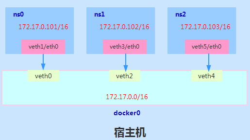
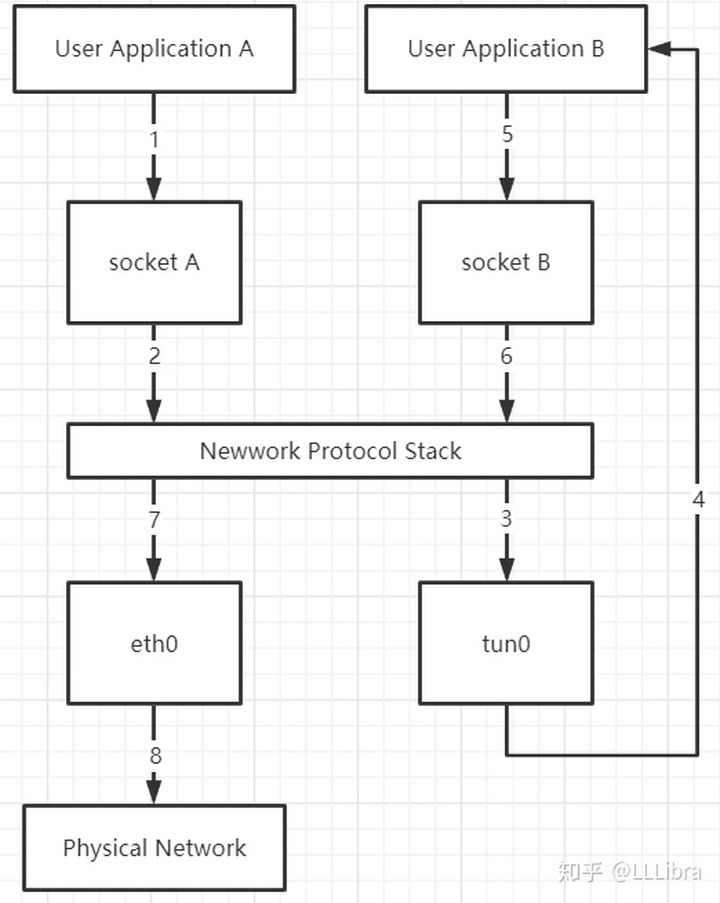

# linux虚拟网络技术

在Linux虚拟化技术中，网络层面，通常重要的三个技术分别是`Network Namespace`、`veth pair`、以及`网桥`或`虚拟交换机`技术.

> 参考资料:
>
> - [虚拟网络设备 tap/tun 原理解析](https://www.cnblogs.com/bakari/p/10450711.html)
>
> - [Linux 虚拟网络设备 veth-pair 详解](https://www.cnblogs.com/bakari/p/10613710.html)
>
> - [Linux 虚拟网络设备详解之 Bridge 网桥](https://www.cnblogs.com/bakari/p/10529575.html)
>
> - [网卡也能虚拟化？网卡虚拟化技术 macvlan 详解](https://www.cnblogs.com/bakari/p/10641915.html)

## 一. Network Namespace 

`Network Namespace`，它是由Linux内核提供，是实现网络虚拟化的重要功能。

通过创建多个隔离的网络空间，实现网络资源的隔离。

不同的`Network Namespace`的资源互相不可见，彼此之间无法通信。


**ip netns命令**

`ip命令`管理的功能很多，和`Network Namespace`有关的操作都在其子命令`ip netns`下进行的，可以通过`ip netns help`查询命令帮助信息.

```shell
$ ip netns help
Usage: ip netns list
       ip netns add NAME
       ip netns set NAME NETNSID
       ip [-all] netns delete [NAME]
       ip netns identify [PID]
       ip netns pids NAME
       ip [-all] netns exec [NAME] cmd ...
       ip netns monitor
       ip netns list-id
       
# ip netns add命令创建一个ns0的网络命名空间
$ ip netns add ns0
# 查看命名空间
$ ip netns list
# 命名空间所在的目录
# 新创建的 Network Namespace 会出现在/var/run/netns/目录下。如果需要管理其他不是 ip netns 创建的 network namespace，只要在这个目录下创建一个指向对应 network namespace 文件的链接即可。
$ ls /var/run/netns/
```

对于每个 `Network Namespace` 来说，它会有自己独立的网卡、路由表、ARP 表、iptables 等和网络相关的资源。

ip命令提供了`ip netns exec`子命令可以在对应的 `Network Namespace` 中执行命令。

```shell
# 查看网络命名空间ns0的网卡信息
$ ip netns exec ns0 ip addr
# 默认loopback网卡是不启用的,下面是启用
$ ip netns exec ns0 ip link set lo up
# 在网络命名空间ns0打开shell
$ ip netns exec ns0 /bin/bash
```

## 二. veth pair

默认情况下，`network namespace` 是不能和主机网络或者其他 network namespace 通信的

可以使用 Linux 提供的`veth pair`来完成通信，veth pair你可以理解为使用网线连接好的两个接口，把两个端口放到两个namespace中，那么这两个namespace就能打通。


```shell
# 创建veth pair
$ ip link add type veth
# 查看veth pair
$ ip link
# 可以创建时指定两个端点的名称
$ ip link add veth001 type veth peer name veth002

# 再创建一个网络命名空间ns1
$ ip netns add ns1

# 将veth pair 分别加入ns0 ns1
$ ip link set veth0 netns ns0
$ ip link set veth1 netns ns01

# 分别为这对veth pair 配置ip地址并启用
$ ip netns exec ns0 ip addr add 192.168.1.98/24 dev veth0
$ ip netns exec ns0 ip link set veth0 up
$ ip netns exec ns1 ip addr add 192.168.1.99/24 dev veth1
$ ip netns exec ns1 ip link set veth1 up
# 查看这对veth pair的状态
$ sudo ip netns exec ns0 ip addr
$ sudo ip netns exec ns1 ip addr
# 验证互通
$ ip netns exec ns0 ping -c 10 192.168.1.99
$ ip netns exec ns1 ping -c 10 192.168.1.98
```

**删除 Network Namespace**

```shell
$ ip netns delete ns0
$ ip netns delete ns1
```

## 三. bridge

虽然veth pair可以实现两个 Network Namespace 之间的通信，但 veth pair 有一个明显的缺陷，就是只能实现两个网络接口之间的通信。

如果多个network namespace需要进行通信，则需要借助`bridge`。



```shell
# 创建网桥
$ ip link add docker0 type bridge
# 配置网桥ip 
$ ip addr add 172.17.0.1/16 dev  docker0 
# 启动网桥
$ ip link set dev docker0 up
# 查看网桥状态
$ ip addr docker0
# or
$ ip link show docker0
# or 
$ ifconfig docker0

# 删除网桥 
$ ip link delete docker0
```

> 其它操作同上,可以将所有veth pair加入网桥,形成多个Network Namespace互通

## 四. tap/tun

`tap/tun`设备文件就像一个管道，一端连接着用户空间，一端连接着内核空间。当用户程序向文件 `/dev/net/tun` 或 `/dev/tap0` 写数据时，内核就可以从对应的 `tunX` 或 `tapX` 接口读到数据，反之，内核可以通过相反的方式向用户程序发送数据。

- TUN 是一个虚拟网络设备，它模拟的是一个三层设备，通过它可以处理来自网络层的数据包，也就是 IP 数据包。由于它只模拟到了 IP 层，所以它无法与物理网卡做 bridge，也没有 MAC 地址，但是可以通过三层交换的方式来与物理网卡相互通信。
- TAP 模拟的是一个二层设备，它比 TUN 更加深入，它可以处理数据链路层的数据包，拥有 MAC 地址，可以与物理网卡做 bridge，支持 MAC 层广播，也可以给它设置 IP 地址。




