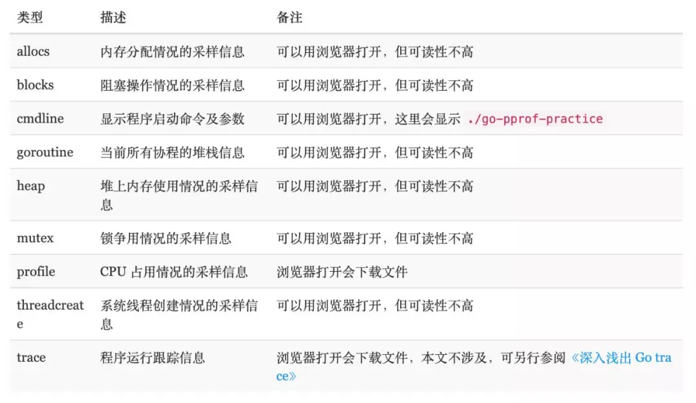

[TOC]

# pprof

- [值得收藏深度解密系列：Go语言之 pprof](https://mp.weixin.qq.com/s?__biz=MzAxMTA4Njc0OQ==&mid=2651438010&idx=5&sn=9641a1dcc64b4d7b6b228c54b3da9834&chksm=80bb6548b7ccec5ef4760cfe32599568c133d97a311c0eab113f14ceecaeaa3f53a07dc0f488&mpshare=1&scene=24&srcid=&sharer_sharetime=1593169627588&sharer_shareid=fbafc624aa53cd09857fb0861ac2a16d&exportkey=AR4ME0Tlj8P7jxFrwP7KfPs%3D&pass_ticket=DDvVwMc9uE8gubEQ4Udh%2F7K9IzRY%2FCbcirMDYkaFdBlrl2%2B2VHn%2BmCXuaTNKOfGb#rd)  
- [golang调试分析的高阶技巧](https://mp.weixin.qq.com/s?__biz=MzU2MDcwNTg3OA==&mid=2247484104&idx=1&sn=082bfb51db063d80aaa1ff2fb05bcae1&chksm=fc02baf1cb7533e767bc7c39dcc4178157dc36ad62efc90c0e084d2f13f86b571a00bbff0a8e&mpshare=1&scene=24&srcid=07181IGjRYzThZJUEEOyuDjJ&sharer_sharetime=1595066004396&sharer_shareid=fbafc624aa53cd09857fb0861ac2a16d&exportkey=AUTW9nFz6go6dtpGga0XpXM%3D&pass_ticket=JHHuXYVoiccTTs1ne62nXMRMpnogIIcB0kUSRdpmlMFWSUL1aXUGL8F6ATfm4cju&wx_header=0#rd)
- [图解Go pprof收集数据的工作流](https://mp.weixin.qq.com/s?__biz=MzAxMTA4Njc0OQ==&mid=2651444315&idx=2&sn=f751f0b06d31a323e56763234d81a8c8&chksm=80bb0aa9b7cc83bfe3cb9a602dcab23bfb2bdcd936732217a2fe794438237f528fa6097070ab&mpshare=1&scene=1&srcid=0116blIlynMiFyXhbb4G7VUF&sharer_sharetime=1611190748128&sharer_shareid=fbafc624aa53cd09857fb0861ac2a16d&exportkey=AXpuvHRIz0m9AxXdOVbyJ%2BY%3D&pass_ticket=JHHuXYVoiccTTs1ne62nXMRMpnogIIcB0kUSRdpmlMFWSUL1aXUGL8F6ATfm4cju&wx_header=0#rd)
- [Go语言 CPU 性能、内存分析调试方法大汇总：你要的都在这](https://mp.weixin.qq.com/s?__biz=MzAxMTA4Njc0OQ==&mid=2651439006&idx=1&sn=0db8849336cc4172c663a574212ea8db&chksm=80bb616cb7cce87a1dc529e6c8bdcf770e293fc4ce67ede8e1908199480534c39f79803038e3&mpshare=1&scene=1&srcid=&sharer_sharetime=1585540493046&sharer_shareid=5e336786609e78d9ce323535f372f069&exportkey=AUB0ik%2FnnB8DEsYzOrZ2mrQ%3D&pass_ticket=edom3%2BQWJv2%2F6ag8wwGj83w98nQSUN8ex7sdZB89cFp%2FbMiUGbmDvKeH%2BLBfXRK2#rd)

pprof 支持四种类型的分析：

- `CPU`：CPU 分析，采样消耗 cpu 的调用，这个一般用来定位排查程序里耗费计算资源的地方；
- `Memroy`：内存分析，在应用程序进行堆分配时记录堆栈跟踪，用于监视当前和历史内存使用情况，以及检查内存泄漏;
- `Block`：阻塞分析，记录 goroutine 阻塞等待同步（包括定时器通道）的位置
- `Mutex`：互斥锁分析，采样互斥锁的竞争情况；

明确几个重要的点：

- golang 内存 pprof 是采样的，每 512KB 采样一次；
- golang 的内存采样的是堆栈路径，而不是类型信息；
- golang 的内存采样入口一定是通过`mProf_Malloc`，`mProf_Free` 这两个函数。所以，如果是 cgo 分配的内存，那么是没有机会调用到这两个函数的，所以如果是 cgo 导致的内存问题，go tool pprof 是分析不出来的；

## 一. pprof的作用

`pprof` 是 Go 语言中分析程序运行性能的工具，它能提供各种性能数据：



> `allocs` 和 `heap` 采样的信息一致，不过前者是所有对象的内存分配，而 heap 则是活跃对象的内存分配。

> 关于 goroutine 的信息有两个链接，
>
> - `goroutine` : 一个汇总的消息，可以查看 goroutines 的总体情况
> - `full goroutine stackdump`可以看到每一个 goroutine 的状态。

> 1. 当 CPU 性能分析启用后，Go runtime 会每 10ms 就暂停一下，记录当前运行的 goroutine 的调用堆栈及相关数据。当性能分析数据保存到硬盘后，我们就可以分析代码中的热点了。
> 2. 内存性能分析则是在堆（Heap）分配的时候，记录一下调用堆栈。默认情况下，是每 1000 次分配，取样一次，这个数值可以改变。栈(Stack)分配 由于会随时释放，因此不会被内存分析所记录。由于内存分析是取样方式，并且也因为其记录的是分配内存，而不是使用内存。因此使用内存性能分析工具来准确判断程序具体的内存使用是比较困难的。
> 3. 阻塞分析是一个很独特的分析，它有点儿类似于 CPU 性能分析，但是它所记录的是 goroutine 等待资源所花的时间。阻塞分析对分析程序并发瓶颈非常有帮助，阻塞性能分析可以显示出什么时候出现了大批的 goroutine 被阻塞了。阻塞性能分析是特殊的分析工具，在排除 CPU 和内存瓶颈前，不应该用它来分析。

## 二. 如何使用

- `runtime/pprof`：采集程序（非 Server）的运行数据进行分析,具体查看`runtime/pprof`相关api

- `net/http/pprof`：采集 HTTP Server 的运行时数据进行分析

  > `http://localhost:8080/debug/pprof/`进入浏览器页面,查看相关的汇总信息

### a. 分析

- 通过命令交互分析

  - 下载得到profile文件直接分析

    ```sh
    $ go tool pprof ./profile
    ```
  - 通过地址直接进入命令交互分析
    ```shell
    # 下载 cpu profile，默认从当前开始收集 30s 的 cpu 使用情况，需要等待 30s
    go tool pprof http://localhost:8080/debug/pprof/profile
    # wait 120s
    go tool pprof http://localhost:8080/debug/pprof/profile?seconds=120     
    # 下载 heap profile
    go tool pprof http://localhost:8080/debug/pprof/heap
    # 下载 goroutine profile
    go tool pprof http://localhost:8080/debug/pprof/goroutine
    # 下载 block profile
    go tool pprof http://localhost:8080/debug/pprof/block
    # 下载 mutex profile
    go tool pprof http://localhost:8080/debug/pprof/mutex
    ```
  
- 通过可视化界面(需要`graphviz`支持)

  - 方法1

  ```shell
  $ go tool pprof -http=:8080 cpu.prof
  ```

  - 方法2

  ```shell
  $ go tool pprof cpu.prof
  $ (pprof) web
  ```

### b. 相关参数

- profile
  - `flat`：给定函数上运行耗时
  - `flat%`：给定函数上运行耗时 占 CPU 运行耗时总比例
  - `sum%`：给定函数累积使用 CPU 总比例
  - `cum`：指该函数加上该函数调用的函数总耗时
  - `cum%`：指该函数加上该函数调用的函数总耗时 占CPU 运行耗时总比例
- heap
  - `-inuse_space`：分析应用程序的常驻内存占用情况
  - `-alloc_objects`：分析应用程序的内存临时分配情况

### c. 火焰图

​    可视化界面已经支持火焰图(Flame Graph),位于VIEW/Flame Graph下.更老版本pprof不支持`-http`参数的,可以下载其它库来支持火焰图`github.com/google/pprof`或者`github.com/uber/go-torch`

如何读懂火焰图可看: 阮一峰的[如何读懂火焰图](http://www.ruanyifeng.com/blog/2017/09/flame-graph.html)


## 三. 系统命令进行性能分析

### a. shell内置time指令

使用`time ./test`对执行程序做了性能分析，得到3个指标。

- `real`：从程序开始到结束，实际度过的时间；
- `user`：程序在**用户态**度过的时间；
- `sys`：程序在**内核态**度过的时间。

一般情况下 `real` **>=** `user` + `sys`，因为系统还有其它进程(切换其他进程中间对于本进程会有空白期)。

### b. /usr/bin/time指令

> 这个指令比内置的time更加详细一些，使用的时候需要用绝对路径，而且要加上参数`-v`
>
> - CPU占用率；
> - 内存使用情况；
> - Page Fault 情况；
> - 进程切换情况；
> - 文件系统IO；
> - Socket 使用情况
> - ...

```shell
$ /usr/bin/time -v ./test

    Command being timed: "./test"
    User time (seconds): 0.12
    System time (seconds): 0.06
    Percent of CPU this job got: 115%
    Elapsed (wall clock) time (h:mm:ss or m:ss): 0:00.16
    Average shared text size (kbytes): 0
    Average unshared data size (kbytes): 0
    Average stack size (kbytes): 0
    Average total size (kbytes): 0
    Maximum resident set size (kbytes): 41172
    Average resident set size (kbytes): 0
    Major (requiring I/O) page faults: 1
    Minor (reclaiming a frame) page faults: 15880
    Voluntary context switches: 897
    Involuntary context switches: 183
    Swaps: 0
    File system inputs: 256
    File system outputs: 2664
    Socket messages sent: 0
    Socket messages received: 0
    Signals delivered: 0
    Page size (bytes): 4096
    Exit status: 0
```

## 四. 性能分析注意事项

### a. 性能分析必须在一个**可重复的**、**稳定的**环境中来进行。

- 不要在共享硬件上进行性能分析;
- 不要在性能分析期间，在同一个机器上去浏览网页
- 机器必须闲置
- 注意省电模式和过热保护，如果突然进入这些模式，会导致分析数据严重不准确
- **不要使用虚拟机、共享的云主机**，太多干扰因素，分析数据会很不一致；

- 关闭电源管理、过热管理;
- 绝不要升级，以保证测试的一致性，以及具有可比性

> 如果承受得起，购买专用的性能测试分析的硬件设备，上架